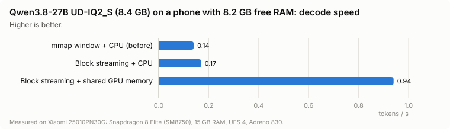
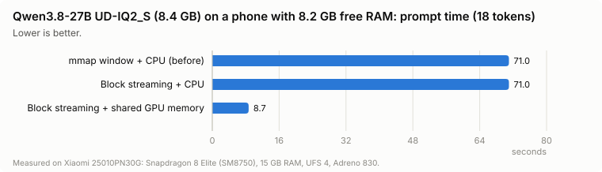
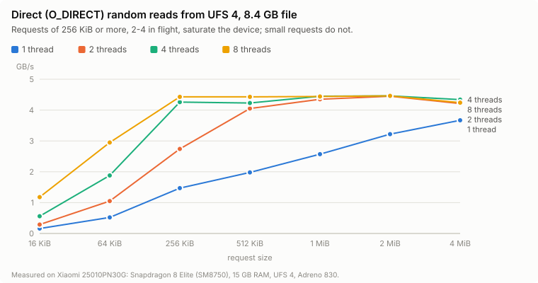
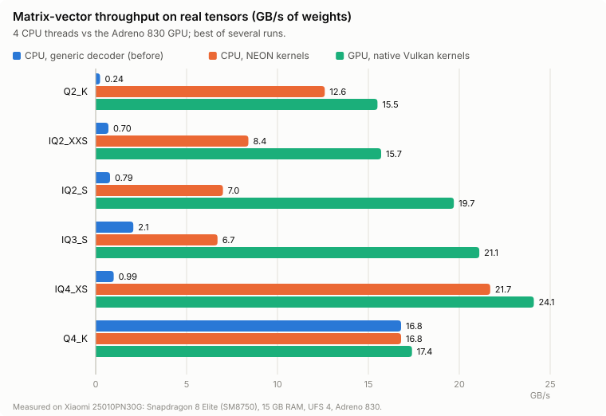
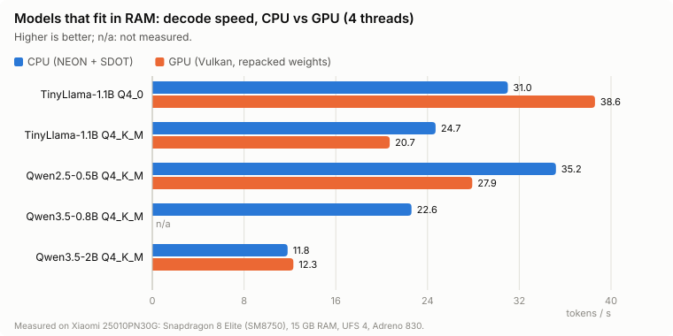
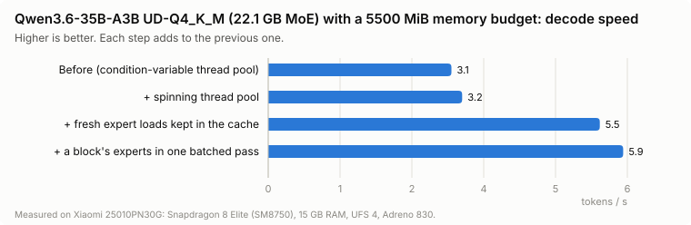
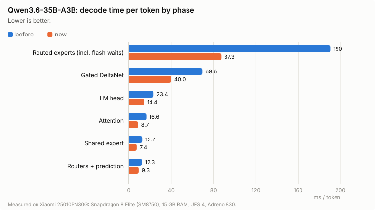

<p align="center"></p>

# Liyab: Ignite your mobile silicon

[]()
[]()

**Liyab** (*Tagalog for "flame"*) is a C++20 inference engine for running GGUF language models directly on phones,
with no cloud dependency. Weights are memory-mapped and read in place, or, for models larger than RAM, streamed
from storage with direct I/O straight into memory the CPU and GPU share; work is routed per device
(NPU → GPU → CPU), and a power manager paces token output and reacts to thermal pressure.

On top of it, the **Liyab app** (Flutter, Android today) is a private assistant that runs entirely on the phone:
chat with open models downloaded from Hugging Face, an assistant sheet that the system's assist gesture opens
over any app, as Gemini's does, and tools that read the user's calendar, notifications, messages and calls when
they ask about their day, with nothing leaving the device. Qwen3.6-35B-A3B, a 22 GB mixture-of-experts
model, answers at about 7–9 tokens per second on a Snapdragon 8 Elite phone, streamed from storage within the
6 GiB an app may use.

This README describes what the code does today. Anything not implemented is listed under
[Limitations and roadmap](#limitations-and-roadmap), not in the feature list.

---

## Contents

* [Status at a glance](#status-at-a-glance)
* [Architecture](#architecture)
* [Supported models](#supported-models)
* [Building](#building)
* [Testing](#testing)
* [Using Liyab](#using-liyab)
* [Models larger than RAM](#models-larger-than-ram)
* [Measured results](#measured-results)
* [Experimental modules](#experimental-modules)
* [Limitations and roadmap](#limitations-and-roadmap)
* [Project layout](#project-layout)

---

## Status at a glance

| Area | Status |
| :--- | :--- |
| GGUF loader (`mmap`, zero-copy, validated against malformed files), split models (`-00001-of-0000N.gguf`) | ✅ implemented |
| Models larger than RAM: dense blocks streamed with parallel `O_DIRECT` reads (resident and streamed blocks interleaved), MoE experts streamed into an LFU cache with router-predicted prefetch | ✅ implemented, automatic (see [Models larger than RAM](#models-larger-than-ram)) |
| Triple-buffered block loader (fetch → prepare → execute) | ✅ implemented (used by block streaming; `--triple-buffer` streams every block) |
| Transformer with per-block mixers and FFNs resolved from the file: softmax attention (GQA, RoPE normal & NeoX, QKV bias, Q/K norm, output gate) or Gated DeltaNet linear attention; dense SwiGLU or mixture of experts (softmax/sigmoid router, top-k, shared expert); llama / mistral / qwen2 / qwen3 / qwen35 / qwen3moe / qwen35moe | ✅ implemented, cross-checked against llama.cpp |
| Every GGML tensor format: F32, F16, BF16, Q4_0/Q4_1/Q5_0/Q5_1/Q8_0, Q2_K–Q6_K, IQ1_S/M, IQ2_XXS/XS/S, IQ3_XXS/S, IQ4_NL/XS, TQ1_0/TQ2_0, MXFP4, NVFP4 (all mixes such as Q4_K_M, IQ3_M) | ✅ implemented, bit-exact vs llama.cpp's reference decoder |
| Paged KV cache, F16 / Q8_0 / INT4 (Q4_0 symmetric, Q4_1 asymmetric) | ✅ implemented |
| Sliding-window attention with attention sinks | ✅ implemented |
| Speculative decoding (draft model or context lookup, batched verification, hybrid models included) | ✅ implemented |
| CPU backend: ARM NEON + dot-product (SDOT), multithreaded (spinning thread pool with dynamically claimed chunks; batched matmuls in one parallel pass); Q4_K / Q5_K / Q6_K / Q8_0 repacked for i8mm (SMMLA) at load | ✅ implemented |
| Apple GPU backend: Metal, zero-copy weights on unified memory | ✅ implemented |
| Android GPU backend: Vulkan compute (Adreno / Mali); weights repacked in GPU memory, or read in place from GPU-shared memory by native kernels for 23 formats (K- and I-quants included) | ✅ implemented, +25% decode vs CPU on Adreno 830 |
| Power manager: duty-cycle pacing, thermal polling, throttle routing | ✅ implemented |
| SoC detection (Snapdragon, Dimensity, Tensor, Exynos, Apple) and backend ranking | ✅ implemented |
| Qualcomm QNN (Hexagon NPU), MediaTek NeuroPilot | 🟡 runtime detection only. Compute falls back to the next backend |
| Tokenizers: SentencePiece and byte-level BPE (Qwen2/Qwen3, Qwen3.5, Llama 3 pre-tokenizers) | ✅ implemented, token-identical to llama.cpp |
| Context kept between chat turns: a prompt that continues the processed text keeps its tokens; hybrid (DeltaNet) models also snapshot their recurrent state at each prompt's end | ✅ implemented (follow-up turns start in ~1.1–1.6 s on the 35B) |
| Liyab app (Flutter, `app/`): chat, model library and Hugging Face downloads, live activity and log, settings, assistant sheet over any app (default digital assistant) | ✅ Android; 🟡 iOS app not built yet (the engine builds for iOS) |
| Agent tools in the app: the model reads the user's calendar, notifications (chats, email previews), SMS, calls, contacts and clipboard, each source enabled by the user | ✅ implemented (Qwen3 / 3.5 / 3.6 tool-call formats) |
| Voice input and output, actions (alarms, events, replies), local memory | 🔜 planned, see [Limitations and roadmap](#limitations-and-roadmap) |
| Experimental: early exit, head pruning, EGLS, TDSS 2:4 sparsity, JIT unpacker, persistent KV prefix cache, io_uring loader | 🧪 behind `LIYAB_ENABLE_EXPERIMENTAL` |

---

## Architecture

```
   Flutter app (dart:ffi)  /  Kotlin (JNI)  /  Swift  /  C++
                        │
              liyab_c_api.h  (stable C ABI)
                        │
   ┌────────────────────▼─────────────────────────────────────────────┐
   │ Engine                                                           │
   │  ├─ DeviceDetect ── SoC + accelerator probes → backend ranking   │
   │  ├─ PowerManager ── thermal polling, pacing, throttle policy     │
   │  ├─ Tokenizer, Sampler, SpeculativeDecoder                       │
   │  └─ Transformer ── per-block mixer (attention / DeltaNet) + FFN  │
   │                    (dense / MoE), paged KV cache, recurrent state│
   └───────┬──────────────────────────────────┬───────────────────────┘
           │ weights                          │ matmuls (Route)
   ┌───────▼──────────────────────────┐   ┌───▼─────────────────────────────┐
   │ MmapLoader (zero-copy GGUF,      │   │ attention → GPU, FFN → NPU,     │
   │  split files)                    │   │ fallback chain NPU → GPU → CPU  │
   │ larger than RAM:                 │   │  Metal ✅ Vulkan ✅ CPU NEON ✅  │
   │  TripleBufferLoader (dense)      │   │  QNN / NeuroPilot 🟡            │
   │  ExpertStore (MoE experts)       │   │ shared memory: GPU reads weights│
   │  DirectFile (parallel O_DIRECT)  │   │  where storage wrote them       │
   └──────────────────────────────────┘   └─────────────────────────────────┘
```

* **Zero-copy weights.** `MmapLoader` maps the GGUF file read-only. Every tensor is a view into the mapping, and
  the CPU kernels read Q4_0/Q4_1/Q8_0 blocks in place. On Apple Silicon each tensor is wrapped in an `MTLBuffer`
  with `newBufferWithBytesNoCopy`, so the GPU reads the page cache directly.
* **Models larger than RAM** stream automatically (file > 80% of available memory): dense models keep as many
  blocks resident as fit and stream the rest, MoE models keep everything but the routed experts resident and
  stream experts through a cache. See [Models larger than RAM](#models-larger-than-ram). The older `mmap`
  streaming window (a prefetch thread keeps the current block and the next two faulted in, `MADV_DONTNEED` behind
  the cursor) remains only for dense split models.
* **Triple-buffered loader.** Three page-aligned slots rotate through a fetch thread (stage 1: parallel direct
  reads), a transform thread (stage 2) and the executing block (stage 3). Block streaming uses it for the streamed
  blocks; `EngineConfig::triple_buffer_loading` (`--triple-buffer`) streams every block. Stage 2 is a pass-through
  because the kernels consume packed blocks directly. Stalls are counted in `GenerationStats::weight_stalls`.
* **Vulkan backend (Android GPUs).** Mobile drivers lack `VK_EXT_external_memory_host` (Adreno 830 included), so
  mmap'd weights cannot be wrapped in place. Two paths:
  * *Shared memory* (`Backend::allocate_shared`): the engine places weights in host-visible, device-local,
    coherent and cached memory (on Adreno the same RAM; direct reads from storage land there and the CPU reads it at
    full speed). Matmuls on tensors inside it bind the region at the tensor's offset and decode the native GGUF
    blocks (`shaders/matvec_native.comp`, 23 formats). Nothing is cached per tensor, so streaming slots can be
    refilled freely. Used for streamed models.
  * *Repacked copies* (models that fit): each tensor is copied once into GPU memory on first use and repacked into
    float scales plus 16-byte quant words (`shaders/matvec.comp`, Q4_0/Q4_1/Q8_0/Q4_K/Q5_0/F16/F32).

  Kernels are compiled with the NDK's `glslc` and embedded at build time; they compute 4 rows per 64-lane
  workgroup. Matmuls that share an input (Q/K/V, gate/up) go out in one submission, and completion is polled briefly
  before the driver wait. A per-call dispatch costs 0.055 ms.
* **Heterogeneous routing.** Attention projections go to the GPU, while the FFN and output head go to the NPU.
  Any backend that reports `Unsupported` falls back to the CPU per matmul.
* **Paged KV cache.** Fixed 64-token pages (all layers per page) come from a pool on demand through a page table.
  Memory grows with the tokens actually cached, freed pages are reused exactly (no fragmentation), and sliding
  windows keep the first `kv_sink_tokens` positions (attention sinks, default 8) plus the last *N* tokens.
* **Power manager.** `pace_token()` caps output at the profile's rate (Balanced 12 tok/s, LowPower 6 tok/s) so the
  SoC idles between tokens. A polling thread reads, once a second, the OS thermal status (Android `AThermal_*`,
  Apple `NSProcessInfo.thermalState`), Android's thermal-headroom forecast 10 s ahead
  (`AThermal_getThermalHeadroom`, Android 12+, smoothed) and the sysfs skin/SoC zones. The response is gradual: the
  forecast becomes a pressure from 0 to 1 over a band of headroom set by the profile (Performance 0.75–0.95,
  Balanced 0.65–0.90, LowPower 0.35–0.60, so a cooler profile reacts earlier). With pressure the engine sheds cores,
  down to half, and paces tokens at up to twice their full-speed work time (learned while unslowed; only from a
  pressure of 0.1: below it a performance hint asking for the current pace kept the clocks there): the same tokens
  at lower clocks, for fewer watts. At pressure 1, at the profile's OS-status limit, above the skin threshold (40 °C
  by default) or with the SoC past its 95 °C emergency limit (on a smoothed reading: the hottest zone spikes by
  25–30 °C for single samples), it reroutes GPU work to the NPU/CPU, halves the active
  threads and halves the token rate (8 tok/s when unpaced). A SoC at 85–90 °C is normal under load on a flagship and
  no longer throttles by itself; the forecast decides. With a forecast the sysfs "skin" reading is an emergency
guard only, 8 °C above the threshold: on many phones it is a board thermistor near the SoC (xo-therm reads
45–50 °C under load), and as a plain threshold it throttled every token of a phone Android rated cool. While pacing on Android 13+, the decode threads report each
  token's work time to a performance-hint session (ADPF, `APerformanceHint_*`) with the token period as its target,
  so the CPU governor runs just fast enough for the rate instead of sprinting and sleeping. Unpaced decoding opens no
  session. Without a forecast (iOS, older Android) the status and temperature guards apply.
* **Speculative decoding.** A small draft model proposes *k* tokens, or, without one (`lookup_drafts`, `liyab-cli
  --lookup`), the tokens that followed the most recent earlier occurrence of the last 4..2 tokens in the
  conversation are proposed (no extra weights, any model). The target verifies them in one batched pass, reading
  its weights once for *k*+1 tokens. Acceptance follows Leviathan et al. (2023), so output matches the
  target's distribution. With greedy sampling it is token-for-token identical to plain decoding (tested). Hybrid
  (DeltaNet) models take part too: with a draft model both keep a copy of their recurrent states after each of the
  last *k*+1 tokens (`Transformer::set_rollback_window`), so rejected tokens roll back exactly (tested). That costs
  (*k*+1) × the recurrent state in memory (62.8 MiB per position for Qwen3.6-35B-A3B) and one state copy per token
  and DeltaNet block. On a MoE whose experts stream from flash the gain is small: a pass over *n* tokens reads
  the union of their experts (35B on the phone: 1.55× the cost of one token for 2, 2.5× for 3). How many drafts to
  verify is learned on the device (`adaptive_drafts`, default; `liyab-cli --fixed-drafts` turns it off): per draft
  count the tokens produced per ms, the best one used, losing counts retried with a doubling wait. Plain steps skip
  the recurrent-state checkpoints. On the 35B writing a WebGL game (256 tokens, `--lookup --draft-tokens 4`, hot
  phone, 2 alternating rounds): 7.57 / 6.49 tok/s without speculation, 6.67 / 6.10 adaptive, 6.87 / 5.44 with a
  fixed *k*. There, speculation does not pay and is better left off (the default).

---

## Supported models

* **Format:** GGUF v2/v3, single file or split with `gguf-split` (open part 1; the other parts must sit next to it
  with their original names).
* **Architectures:** `llama` (Llama 1/2, Mistral, TinyLlama…), `mistral`, `qwen2`, `qwen3` (dense), `qwen35`
  (Qwen3.5 / Qwen3.8 hybrids: three Gated DeltaNet blocks per gated-attention block; the multi-token-prediction head
  is skipped), and the mixture-of-experts `qwen3moe` (Qwen3-30B-A3B…) and `qwen35moe` (Qwen3.5-35B-A3B…). Linear RoPE scaling and Llama 3.x `rope_freqs` are supported. YaRN is rejected with a clear error.
* **How a model is mapped:** the forward pass is not written per model. For every block the loader picks the token
  mixer from the tensors present (`ssm_conv1d` → Gated DeltaNet, otherwise softmax attention), detects optional
  pieces (QKV biases, Q/K norms, an attention output gate when `attn_q` is twice as tall, the pre-FFN norm name),
  and only the KV cache of attention blocks is allocated. The FFN is a mixture of experts when the block has a
  router (`ffn_gate_inp`): softmax or sigmoid gating (`expert_gating_func`), optional selection bias, top-k,
  renormalization and scale from the metadata, plus an optional shared expert with a sigmoid gate; tokens of a
  batch are grouped per expert so each expert is read once. An architecture adds a one-line traits row (RoPE
  style, MoE weight renormalization default).
  DeltaNet blocks keep a recurrent state (conv history + one 128×128 matrix per value head, 19 MiB for Qwen3.5-2B):
  such models roll back only inside a rollback window of recurrent-state checkpoints (used by speculative decoding)
  or to a state snapshot taken at the end of each prompt (two kept: the oldest and the newest), so early exit,
  head pruning and the KV prefix cache are disabled for them with a clear message.
* **Tensor types:** every format llama.cpp writes, mixed freely per tensor. That covers F32, F16, BF16, the legacy
  Q4_0/Q4_1/Q5_0/Q5_1/Q8_0, the K-quants Q2_K…Q6_K (and their Q*_K_S/M/L mixes), the I-quants IQ1_S, IQ1_M,
  IQ2_XXS/XS/S, IQ3_XXS/S, IQ4_NL, IQ4_XS, the ternary TQ1_0/TQ2_0 and the FP4 formats MXFP4/NVFP4. Q1_0 is
  rejected with a clear error. Decoders are ported from llama.cpp's gguf-py reference. `tests/data/quant_vectors.bin`
  (written by `tools/gen_quant_vectors.py`) holds reference outputs, and `test_engine` checks all 24 formats
  bit-exactly. I-quant grids are extracted from gguf-py by `tools/gen_quant_tables.py`.
* **Kernels:** Q4_0/Q4_1/Q8_0 and Q5_0/Q5_1 have dedicated NEON + SDOT kernels that unpack bits in registers.
  The K-quants Q2_K to Q6_K, TQ2_0, IQ1_S/M, IQ2_XXS/XS/S, IQ3_XXS/S and IQ4_XS use NEON kernels adapted from
  llama.cpp (`src/core/quant_lowbit.cpp`) against Q8_K activations (one scale per 256 values plus 16-value sums,
  quantized once per matmul), so a whole super-block accumulates in int32 and is scaled once (for Q4_K–Q6_K this
  roughly doubled single-core throughput on Apple M4 over the previous per-32-value Q8_0 path); IQ4_NL and MXFP4 use table-lookup kernels against Q8_0. TQ1_0 and NVFP4 (and every format on
  non-NEON targets) decode each block to int8 values with per-16 scales, then use SDOT. On Vulkan, weights in
  ordinary memory are copied once (Q4_K and Q5_0 repacked exactly into the Q4_1/Q8_0 layouts; other formats fall
  back to the CPU per matmul); weights in GPU-shared memory (`Backend::allocate_shared`) are read in place by
  native-layout kernels (`shaders/matvec_native.comp`) for F32, F16, Q4_0/1, Q5_0/1, Q8_0, Q2_K–Q6_K, IQ1_S/M,
  IQ2_XXS/XS/S, IQ3_XXS/S, IQ4_NL/XS, TQ2_0 and MXFP4, decoding the GGUF blocks with the CPU decoders' bit layouts.
* **Tokenizers:** SentencePiece (`llama`) and byte-level BPE (`gpt2`) with the `qwen2`, `deepseek-r1-qwen`,
  `qwen35` (letters include combining marks, `\p{M}`), `llama-bpe` and `llama3` pre-tokenizers. Both match llama.cpp's tokenization token for token, including special
  tokens, contractions, digits, accents, CJK and emoji. BOS is added only when the model asks for it.
* Prompts are used as given: apply the model's chat template in the app.

---

## Building

Requirements: CMake ≥ 3.22, a C++20 compiler (Clang 17+ / Apple Clang 15+), Ninja recommended.
Android: NDK r26+. iOS: Xcode 15+.

### Host (macOS / Linux)

```bash
cmake -S . -B build -G Ninja -DCMAKE_BUILD_TYPE=Release
cmake --build build
ctest --test-dir build --output-on-failure
```

### Android (`arm64-v8a`)

```bash
scripts/build_android.sh                 # libliyab.so, liyab-cli and tests in build/android/arm64-v8a
scripts/build_android.sh --experimental  # also builds the experimental modules
scripts/build_android.sh --help          # --abi, --api, --ndk, --no-vulkan, --no-qnn, --no-neuropilot, ...
```

The NDK is located from `--ndk`, `$ANDROID_NDK_HOME`, or the newest NDK in the usual SDK locations.
The Liyab app (Flutter 3.x, Android SDK platform 36, JDK 17) builds with `scripts/build_flutter_app.sh [--install]`,
which builds `libliyab.so` with this script first (see [Liyab app](#liyab-app-flutter-app)).
The `.so` is linked with 16 KB page alignment, which Android 15+ devices with 16 KB pages require.

### iOS (`.xcframework`)

```bash
scripts/build_ios.sh   # build/ios/Liyab.xcframework: device arm64 + simulator arm64/x86_64
```

The framework holds a static library, the headers and a module map, so Swift can `import Liyab`. The module map
auto-links Metal, Foundation and libc++. If `xcodebuild` reports missing components, run
`sudo xcodebuild -runFirstLaunch` once.

### CMake options

| Option | Default | Effect |
| :--- | :--- | :--- |
| `LIYAB_USE_NEON` | ON on arm64 | NEON intrinsics kernels |
| `LIYAB_ARM_DOTPROD` | ON on arm64 | `-march=armv8.2-a+dotprod+fp16` on Android/iOS/Linux (SDOT). AArch64 needs no `-mfpu`: NEON is part of the base ISA |
| `LIYAB_USE_METAL` | ON on Apple | Metal GPU backend |
| `LIYAB_USE_VULKAN` | ON on Android | Vulkan GPU backend + probe (loader opened with `dlopen`; shaders need `glslc` from the NDK or Vulkan SDK) |
| `LIYAB_USE_QNN` | ON on Android | QNN HTP runtime probe (no SDK needed) |
| `LIYAB_USE_NEUROPILOT` | ON on Android | NeuroPilot runtime probe |
| `LIYAB_ENABLE_EXPERIMENTAL` | OFF | Early exit, head pruning, EGLS, TDSS, JIT unpacker, KV dedup, io_uring loader, `test_experimental` |
| `LIYAB_BUILD_SHARED` | ON | Shared (`.so`/`.dylib`) or static library |
| `LIYAB_BUILD_TESTS` / `LIYAB_BUILD_CLI` | ON | Unit tests / `liyab-cli` |

---

## Testing

The tests depend on nothing beyond the compiler. They generate small GGUF models on the fly, so no download is
needed.

| Suite | Covers |
| :--- | :--- |
| `test_mmap` | mapping, `madvise` hints, NEON INT4→INT8 unpacking, GGUF parsing and malformed-file rejection, split models (parts, missing part, opening a later part), prefetcher, triple-buffer pipeline (ordering, resync, unpack stage, stall accounting, errors) |
| `test_device_detect` | SoC classification, backend ranking, live detection, sysfs thermal parsing, power policy, pacing |
| `test_engine` | quant kernels (including the Q8_K low-bit kernels against llama.cpp-encoded blocks), tokenizer, transformer vs an independent float reference, batching/rollback, sliding window + sinks, MoE vs its dense twin, streamed experts (with evictions) vs in-place reads, Metal vs CPU, triple-buffer vs mmap equivalence, speculative decoding invariants, cancellation, pacing, C API |
| `test_kv_cache` | memory per token, on-demand paging and reuse, sinks and page recycling over 5000 positions, quantization accuracy, engine KV memory |
| `test_backends` | per-matmul latency of each backend on a model's shapes, grouped submissions, dispatch overhead; batched CPU matmuls (mixed formats, shared inputs) equal one matmul per item |
| `test_experimental` | early exit, head pruning, direct I/O correctness, plus throughput and I/O benchmarks (`LIYAB_BENCH=0` skips them, `LIYAB_BENCH_MB=N` sizes the I/O file) |

`liyab-bench` (built with the tests) measures CPU matvec throughput on a MoE model's decode shapes (Q8_0 projections,
F32 routers, Q6_K LM head, Q4_K/Q5_K/Q6_K experts) in GB/s, next to the RAM read ceiling, for several thread counts:
`liyab-bench --threads 1,4,8 --seconds 1`. A last table times one matmul over 1, 2, 4 and 5 activation rows (the shape
of speculative verification and prefill).

`liyab-kl` (also built with the tests) measures what a lossy option costs: it saves the teacher-forced next-token
distributions of a model over a text from the lossless path (`--save ref.bin`), then compares a lossy run against them
(`--compare ref.bin --requant 4`): KL divergence over the reference's top 32 tokens plus the remaining mass, top-1
agreement and both perplexities. The two runs are separate processes, so a model that fills the RAM fits once.

On a device (USB debugging enabled):

```bash
scripts/build_android.sh --experimental
adb shell mkdir -p /data/local/tmp/liyab
adb push build/android/arm64-v8a/{libliyab.so,liyab-cli,test_*} /data/local/tmp/liyab/
adb shell 'cd /data/local/tmp/liyab && export LD_LIBRARY_PATH=. TMPDIR=/data/local/tmp/liyab &&
           for t in test_*; do ./$t || exit 1; done'
adb shell 'cd /data/local/tmp/liyab && LD_LIBRARY_PATH=. ./liyab-cli --device'
```

---

## Using Liyab

### C++

```cpp
#include "liyab/liyab.h"
#include <iostream>

int main() {
    liyab::EngineConfig config;
    config.model_path = "/data/local/tmp/model-q4_0.gguf";
    config.power.profile = liyab::PowerProfile::Balanced;  // paced to ~12 tok/s, throttles at 40 °C skin
    config.kv_cache_type = liyab::KvCacheType::Q8_0;       // or Q4_0 / Q4_1 for long contexts

    auto engine = liyab::Engine::create(config);
    if (!engine) {
        std::cerr << engine.status().to_string() << "\n";
        return 1;
    }
    std::cerr << engine.value()->describe();

    liyab::SamplingParams params;
    params.max_tokens = 128;
    auto stats = engine.value()->generate("Explain unified memory in one paragraph.", params,
                                          [](std::string_view piece, int32_t /*token*/) {
                                              std::cout << piece << std::flush;
                                              return true;  // false stops generation
                                          });
    if (stats) std::cerr << "\n" << stats->tokens_per_second << " tok/s\n";
}
```

`Engine::cancel()` is thread-safe and stops generation at the next token boundary.

The context is kept between calls: when a prompt continues the text the engine already processed (the previous
prompt plus its generated reply, which is how a chat grows), that text keeps the tokens it was processed as and only
the rest is processed, recurrent DeltaNet states included. Re-encoding a reply need not give back the tokens that
were generated (e.g. around `</think>` or merged spaces); before, any such difference made a hybrid model start over.
Otherwise the longest common token prefix is kept: any length on attention-only models, and on hybrid models back to
the nearest recurrent-state snapshot, taken at the end of every prompt and `prefill()`. An edited last reply or a
turn dropped from the history then recomputes only what follows the previous prompt or the system prompt.
`Engine::prefill(text)` processes a prefix ahead of time (a chat's system prompt right after loading) and
`reset_context()` forgets everything. `Engine::save_state(path)` writes the context to a file (KV pages of the
cached positions, recurrent states, and the tokens and text they encode; through a temporary file and a rename)
and `load_state(path)` restores it in a later process, only for the same model file loaded with the same cache
settings (a fingerprint of the file size, model shape and KV layout is checked), so a long system prompt is
processed once, not after every start. C ABI: `liyab_engine_save_state` / `liyab_engine_load_state`. The output equals a fresh context's (tested), except that a reused reply keeps
the tokenization it was generated with. The two snapshots cost 2 × the recurrent state (~120 MiB on
Qwen3.6-35B-A3B), set aside from the expert cache budget. On the phone, Qwen3.6-35B-A3B's first token went from 13–16 s per
message (whole conversation reprocessed) to 3.2 s for the first message and ~6 s for later ones.

`Engine::trim_memory()` (C ABI: `liyab_engine_trim_memory`) gives memory back while the engine is idle: it empties
the MoE expert cache and returns its pages to the OS; the model and its context stay loaded. It keeps the cache's
hot list (the cached experts by use): `warm_memory()` queues them again behind any demand read, so the cache
refills in one background pass of large reads (about 0.7 s for 2.4 GB at 3.5 GB/s) once the model is used again,
instead of a wait per expert; `save_expert_profile()` / `load_expert_profile()` keep the list in a small file for a
later process (C ABI: `liyab_engine_warm_memory`, `liyab_engine_save_expert_profile`,
`liyab_engine_load_expert_profile`). The app warms the cache when the user starts writing, and right after a load. On the phone,
Qwen3.6-35B-A3B with a 4000 MiB budget went from 3.09 GB resident after two answers to 2.18 GB; the next answer
decoded at 6.13 tok/s instead of 6.43 (first token 272 ms instead of 177) while the cache refilled, and the one after
at full speed.

### C ABI (`liyab_c_api.h`)

```c
liyab_engine_config config;
liyab_engine_config_default(&config);
config.model_path = path;

liyab_engine* engine = NULL;
if (liyab_engine_create(&config, &engine) != LIYAB_OK) { fprintf(stderr, "%s\n", liyab_last_error()); }

liyab_sampling_params params;
liyab_sampling_params_default(&params);
liyab_generation_stats stats;
liyab_engine_generate(engine, "Hello", &params, on_piece /* (piece, len, token, user) -> continue? */, user, &stats);
liyab_engine_destroy(engine);
```

No C++ exception crosses the ABI. Errors are returned as `liyab_status`, with the message available from
`liyab_last_error()` (thread-local). Log messages reach a callback (`liyab_set_log_callback`, called on the logging
thread) or, for UIs that poll, a buffer: `liyab_log_buffer_enable(max_bytes)` keeps the latest lines as
`"<D|I|W|E> message\n"` and `liyab_log_buffer_take(buf, size)` hands over whole lines and removes them. `liyab_engine_prefill` / `liyab_engine_reset_context` expose the context reuse
described above. `liyab_engine_metadata(engine, "general.sampling.temp", buf, size)` reads a
scalar GGUF metadata value of the loaded model as text (e.g. the publisher's recommended sampling), returning -1 when
the key is absent; `Engine::model_metadata()` is the C++ equivalent. `liyab_supported_architectures(buf, size)` (C++: `supported_architectures()`) lists the GGUF architectures the
build runs, so front ends can filter downloads without a copy of the list. `liyab_engine_config.expert_cache_mb`
(`EngineConfig::expert_cache_mb`) sizes the MoE expert cache (-1 automatic, 0 off); `memory_budget_mb` caps the
memory the engine keeps resident (weights, expert cache, streaming slots), for platforms whose per-app limits the
OS counters do not show (`liyab-cli --memory-budget MB`); `requant_bits` (4 or 5, default 0 = off; `liyab-cli
--requant 4|5`) converts the resident Q8_0 matrices of a MoE model with streamed experts to Q4_K or Q5_K at load
(lossy, see the 35B results below), and -1 does so only when memory is tight: when the expert cache would hold under
10% of the experts, where nearly every token waits for storage (Q5_K if that frees enough memory, else Q4_K; the
app's default). `Engine::memory_plan()` (`liyab_engine_memory_plan`) reports the resident bytes, the experts' bytes,
the expert cache and the budget at which 15% of the experts would be cached, so an app can tell the user that a
budget is too small for a model (the Liyab app does, in its status line and Settings); `moe_expert_mass` (`liyab-cli --expert-mass P`, default 1 = off) runs, per token,
only the top experts covering a fraction P of the router weight (lossy, see below); `moe_max_experts` (`liyab-cli
--experts N`, default 0 = the model's top-k) caps the experts per token (lossy when below the model's count);
`moe_skip_slow` (`liyab-cli --skip-slow W`, default 0 = off) skips a chosen expert that is not in RAM yet instead of
waiting for its read when, for every token using it, its router weight is below a share W of the token's experts
(the others renormalized; lossy, in the app's Experimental section); with streamed experts every Q4_K / Q5_K /
Q6_K / Q8_0 expert matrix is rearranged on the I/O thread into the CPU's i8mm layout as it arrives (lossless, same
size; only experts read for a multi-token pass, since on a decode miss the rearrangement only delayed the read), so
prefill multiplies it by many tokens at once (a 706-token prompt 9% faster), and prefill runs in passes of 1024
tokens (each reads the union of its tokens' experts once: 26 instead of 70 MiB per token on that prompt with
Qwen3.6-35B-A3B, for 81 MiB more peak memory than passes of 512); and
`liyab_generation_stats`
reports `expert_hits`, `expert_late`, `expert_misses`, `expert_bytes_read`, `expert_stall_ms`,
`expert_unused` (experts read and evicted again without being used), `expert_predicted` and
`expert_predicted_used` (experts guessed one block ahead, and how many of them the router chose), `expert_dropped`
(wrong guesses removed from the read queue once their block's router chose: those already read become the next to
evict, instead of keeping their prefetch bonus), `expert_skipped` (experts skipped by `moe_skip_slow`), plus where decode
time went: `attention_ms`, `delta_net_ms`, `router_ms`, `experts_ms`, `shared_expert_ms`, `dense_ffn_ms` and `lm_head_ms` (C++:
`GenerationStats::decode_phases`; `liyab-cli` prints them per token).
`liyab_engine_get_counters` (C++: `Engine::counters()`) returns live cumulative counters for monitoring UIs (GPU
busy time spent on the engine's work, bytes streamed from storage, tokens generated); it is safe to call while a
generation runs.

### Android (Kotlin)

The library exposes the C ABI. The JNI glue lives in your app, because its symbol names depend on your Kotlin
package:

```cpp
// app/src/main/cpp/liyab_jni.cpp
#include <jni.h>
#include "liyab/liyab_c_api.h"

struct Ctx { JNIEnv* env; jobject cb; jmethodID onToken; };

extern "C" JNIEXPORT jlong JNICALL
Java_com_example_ai_Liyab_nativeCreate(JNIEnv* env, jclass, jstring path) {
    liyab_engine_config c; liyab_engine_config_default(&c);
    const char* p = env->GetStringUTFChars(path, nullptr);
    c.model_path = p;
    liyab_engine* e = nullptr;
    liyab_engine_create(&c, &e);
    env->ReleaseStringUTFChars(path, p);
    return reinterpret_cast<jlong>(e);
}

extern "C" JNIEXPORT void JNICALL
Java_com_example_ai_Liyab_nativeGenerate(JNIEnv* env, jclass, jlong h, jstring prompt, jobject cb) {
    Ctx ctx{env, cb, env->GetMethodID(env->GetObjectClass(cb), "onToken", "([B)Z")};
    liyab_sampling_params sp; liyab_sampling_params_default(&sp);
    const char* p = env->GetStringUTFChars(prompt, nullptr);
    liyab_engine_generate(reinterpret_cast<liyab_engine*>(h), p, &sp,
        [](const char* s, size_t n, int32_t, void* u) -> int32_t {
            auto* c = static_cast<Ctx*>(u);
            jbyteArray bytes = c->env->NewByteArray(static_cast<jsize>(n));
            c->env->SetByteArrayRegion(bytes, 0, static_cast<jsize>(n), reinterpret_cast<const jbyte*>(s));
            const jboolean go = c->env->CallBooleanMethod(c->cb, c->onToken, bytes);
            c->env->DeleteLocalRef(bytes);
            return go ? 1 : 0;
        }, &ctx, nullptr);
    env->ReleaseStringUTFChars(prompt, p);
}
```

```kotlin
object Liyab {
    init { System.loadLibrary("liyab"); System.loadLibrary("app_jni") }
    external fun nativeCreate(modelPath: String): Long
    external fun nativeGenerate(handle: Long, prompt: String, cb: TokenCallback)
    fun interface TokenCallback { fun onToken(utf8: ByteArray): Boolean }
}
// Pieces are complete UTF-8, so String(bytes, Charsets.UTF_8) is safe.
```

Run generation off the main thread. `liyab_engine_cancel` can be called from any thread.

### iOS (Swift)

```swift
import Liyab

final class LiyabEngine {
    private var engine: OpaquePointer?

    init(modelPath: String) throws {
        var config = liyab_engine_config()
        liyab_engine_config_default(&config)
        let status = modelPath.withCString { path -> liyab_status in
            config.model_path = path
            return liyab_engine_create(&config, &engine)
        }
        guard status == LIYAB_OK else { throw NSError(domain: String(cString: liyab_last_error()), code: Int(status.rawValue)) }
    }

    func generate(_ prompt: String, onPiece: @escaping (String) -> Bool) {
        var params = liyab_sampling_params()
        liyab_sampling_params_default(&params)
        let box = Unmanaged.passRetained(onPiece as AnyObject)
        defer { box.release() }
        liyab_engine_generate(engine, prompt, &params, { piece, len, _, user in
            let cb = Unmanaged<AnyObject>.fromOpaque(user!).takeUnretainedValue() as! (String) -> Bool
            let data = Data(bytes: piece!, count: len)
            return cb(String(decoding: data, as: UTF8.self)) ? 1 : 0
        }, box.toOpaque(), nil)
    }

    deinit { liyab_engine_destroy(engine) }
}
```

### Liyab app (Flutter, `app/`)

`app/` is the Liyab app in Flutter, for Android now and iOS next. It
calls the C ABI directly through `dart:ffi` (hand-written bindings in `app/lib/engine/liyab_ffi.dart`, mirroring
`liyab_c_api.h`): model loads, prefills and generations run on a worker isolate, while cancel and the live counters
are called directly because the C API makes them thread-safe.

* **Pages.** A navigation drawer (with the model in use) leads to Chat, Models, Activity and Settings; the first
  launch shows a welcome page that explains the privacy model and asks for the one permission.
* **Assistant sheet.** Liyab can be the default digital assistant (Settings → Assistant opens the system's
  default-apps page; Android does not let apps request that role with a dialog). The assist gesture (holding the
  power or home button) then starts `AssistActivity` through `ACTION_ASSIST`: a see-through window over the
  current app where a sheet rises with the living flame, a text field and the latest answer. Dragging its handle
  or header resizes it (it stays where it is let go); reaching the top edge, flinging it up or the expand button
  turns it into the app itself, as Gemini's overlay does: the chat screen with
  the whole conversation and the navigation drawer (Models, Activity, Settings), still in the same window over the
  previous app; "Show as a sheet" or Back shrinks it to the sheet again, and closing returns to the app. (Pages
  that need a full activity, such as importing a file, may not open from that window yet.) Its edge glows in the flame's colours (following the
  phone's heat) and, while the model works, pulses with a light running along the top edge. Both windows share one Flutter engine (`LiyabEngine`,
  created by the first activity, not at process start, so download jobs never load a model), so the sheet uses the
  model already loaded instead of loading a second copy. Since one engine draws into one surface and keeps one
  lifecycle state, only the window in front reports lifecycle states and takes the surface back when it returns,
  and the sheet releases it as soon as it pauses (otherwise the app window went black after the sheet).
* **Agent tools.** The assistant can read the user's own data to answer about their day: calendar events
  (`READ_CALENDAR`), notifications from every app, i.e. chat messages and email previews (Android's Notification
  access, kept in memory only), text messages (`READ_SMS`), calls (`READ_CALL_LOG`), contacts (`READ_CONTACTS`) and
  the clipboard. Each source is off until the user turns it on under Settings → What Liyab can read (which asks
  for the permission); only enabled sources are offered to the model. Tools are described and called in the
  loaded model's own format, read from its GGUF chat template: Qwen3.5 / Qwen3.6 XML calls
  (`<function=…><parameter=…>`) or Qwen2.5 / Qwen3 JSON calls; the app runs a call on the phone, returns the result
  in a `<tool_response>` turn and lets the model continue, up to 4 calls per reply, each shown above the answer
  ("Read your calendar: 3 events"). Results are short text, one line per item with ISO dates (no day or month names
  that could leak into an answer in another language), capped (25 notifications with chat apps' reposts dropped,
  30 messages or calls) and with long texts cut: on Qwen3.5/3.6's tokenizer 6 events take 190 tokens instead of 428
  as JSON and 25 notifications 713 instead of 1375, about 18 s and 50 s less to process on Qwen3.6-35B-A3B before
  the answer starts. Every user turn ends with the current date and time (`[Now: Friday 9 October
  2026, 13:40, UTC+02:00]`; placed first, Qwen3.6 copied it at the start of its replies) so "in two hours" means
  something, while the system prompt stays fixed and its context
  reused. The default system prompt tells the model to use tools for the user's data, never to invent it, and to
  treat tool results as data, not instructions. Not readable: full email bodies (Android gives apps no access to
  Gmail; only the notification previews) and the screen content (needs a voice-interaction service).
* **Chat.** Replies stream token by token, with the model's reasoning folded under a "Reasoning" line. The history
  is cut by the context's token budget (counted with the model's tokenizer), not by a fixed number of turns, and
  every past reply is replayed exactly as generated, so each new message reuses the engine's context. The system
  block (the system prompt plus the enabled tools' descriptions) is restored right after loading from the state
  saved the first time it was processed (one file per model, named by the block's hash, under `states/`); only a
  changed prompt or tool list is processed again, about a minute on Qwen3.6-35B-A3B.
* **Models.** *On this phone* lists app storage and the shared folder (marked, since streaming is slower there,
  with **Move to app storage**, which copies every part and removes the shared copy), marks models larger than the
  memory budget as streamed, and imports a GGUF from anywhere through the system file picker. *Get models* searches
  Hugging Face (public API, nothing about the user is sent), lists each repository's quantizations (split models as
  one entry), reads `general.architecture` from the first 64 KiB to flag models the engine cannot run, and downloads
  with `background_downloader`: 4 parallel range requests per file, pause / resume / cancel, resumed after the app
  closes, run as a foreground data-sync job with a progress notification, and each part checked against the
  SHA-256 Hugging Face publishes.
* **Activity.** Live meters (tok/s, battery W, CPU %, storage MB/s, thermal status with Android's 10 s headroom
  forecast, J/token on battery) with two-minute sparklines, sampled once a second only while the app is in the
  foreground; plus the app's and the engine's log (`liyab_log_buffer_*`), copyable.
* **Settings.** Sampling, context length and system prompt per model; CPU/GPU, speed or coolness (Fastest,
  Balanced by default, Coolest: the engine's power profiles, applied at once), thermal limit, memory budget and idle
  release per device; the permissions Liyab uses and why (notifications only; no storage permission: models live in app
  storage and imports go through the system picker). **Experimental** exposes the engine's lossy, unfinished or
  measurement-only options, applied on the next load and listed in the Activity log: early exit, head pruning, EGLS
  FFN skipping, 2:4 sparse FFN (TDSS), the persistent prefix KV cache (KV dedup), lookup speculative decoding and its
  draft length, MoE expert mass and experts per token, requantized resident matrices, KV cache format and thread
  count. The app's `libliyab.so` is built with `LIYAB_ENABLE_EXPERIMENTAL=ON` for this; everything is off by default.
* **Long conversations.** When the history no longer fits the context, it is compacted in one step: the oldest
  turns leave the model's context until the history fills at most half of the room (a line in the chat marks the
  cut; the messages stay on screen). Dropping one turn per message instead would change the start of every prompt,
  and the engine would process the whole conversation again for each message; this way the following messages
  extend the same prompt and the cost comes once every many messages. The cut is saved with the conversation.
* **Typing ahead.** While the user writes, the stable part of the draft (whole words, cut where its tokens are a
  prefix of the text so far, since a hybrid model's context is reused only up to the snapshot at the end of a
  prefill) is processed in the background, 0.6 s after the last keystroke, starting with the history. Sending then
  costs only the last words and the time line (its digits are a token each: about 25 tokens).
  On a MoE whose experts stream from storage a prompt token costs about as much as a generated one
  (Qwen3.6-35B-A3B: 45 new prompt tokens took 5.9–6.8 s before the first word), so this hides most of that wait.
  Each generation of a reply is logged (new and reused prompt tokens, first token, speed).
* **Leaving the screen.** HyperOS stops a background app that holds several GB within a minute
  (`kill_bg_proc`), and the process outlives its window anyway (the notification listener keeps it running). So the
  moment Liyab is hidden it parks: the expert cache is emptied (`trim_memory`: 2.4 GB on Qwen3.6-35B-A3B at the
  default budget; the model stays loaded and answers at once) and the conversation is saved in app storage, its
  messages and the engine's context (`save_state`, ~200 MB on that model; the messages alone are also saved after
  every reply, since the OS may stop Liyab while a reply finishes in the background). If the OS stops Liyab anyway, the next start brings the
  conversation back, context included, so it is not processed again. After 5 minutes hidden (1, 15, 60 minutes or
  never in Settings) the model is unloaded as well; it loads again as soon as Liyab is on screen, the app or the
  assistant sheet. A message sent meanwhile shows at once and waits for the model, and while it loads the flame
  burns in the middle of the conversation ("Waking up"). A new chat or another model deletes the saved
  conversation. App events (loads, restores, trims; never message text or tool arguments) also go to logcat
  (`adb logcat -s flutter`).
* **The living flame.** The Liyab mark (`docs/brand`) is drawn live in the header and the empty chat: its motion
  shows whether the assistant is resting, thinking or answering, and its colour follows the phone's thermal
  headroom (cool with headroom, hot near throttling). It redraws about 24 times a second at rest and 30 while the
  model works, and the chat batches streamed text into ~15 redraws a second, so the UI leaves the cores to the
  engine.

Not yet in the Flutter app: the floating performance overlay over other apps (the Activity page replaces it inside
Liyab).
The application id is `com.liyab.chat` and the APK is signed with `build/liyab-debug.keystore` (the earlier Java
demo app's key, so installing over that app kept its models).

```bash
scripts/build_flutter_app.sh --install   # libliyab + release APK; waits while the app is on screen or downloading
cd app && flutter analyze && flutter test
```

Downloads go to app-private internal storage (`files/models`), which is plain f2fs: the engine's direct reads
work there and streaming runs at full speed. Models pushed with `adb` go to the shared app folder
`/sdcard/Android/data/com.liyab.chat/files/` (launch the app once first so the folder belongs to the app, and make
pushed files readable with `chmod 666`). Android serves that folder through FUSE, where direct reads are unusable
(the engine detects it and falls back to buffered reads, several times slower for models larger than RAM), so the
Models page marks those files and offers **Move to app storage**.

### Command line

```bash
liyab-cli --device                                    # SoC, accelerators, backend ranking
liyab-cli -m model.gguf -p "Once upon a time" -n 128 --temp 0.8
liyab-cli -m model.gguf -p "..." --draft draft.gguf   # speculative decoding
liyab-cli -m model.gguf -p "..." --window 1024 --sinks 8 --kv q4_1
liyab-cli -m model.gguf -p "..." --profile low_power --skin-threshold 45
liyab-cli -m big-model.gguf -p "..." --triple-buffer      # stream every block (automatic streaming picks a mix)
liyab-cli -m moe-model.gguf -p "..." --expert-cache 3000  # MoE: stream experts through a 3000 MiB cache (-1 auto)
liyab-cli -m model.gguf -p "..." --tokenize               # print token ids
liyab-cli --help
```

---

## Models larger than RAM

Streaming is automatic when a model does not fit (file larger than 80% of the available memory).

* **Storage.** UFS reads are fast only when large and concurrent: on the Snapdragon 8 Elite phone below, direct
  reads reach ~4.4 GB/s with 2–4 requests ≥ 256 KiB in flight, random or sequential alike, but stay under
  1.2 GB/s at 16 KiB. `DirectFile` reads with `O_DIRECT` (no page-cache copy, no eviction of resident weights) and
  splits large reads into concurrent 4 MiB requests. On FUSE (Android's `/storage/emulated`), direct reads were
  seen to return success without the file's bytes, so `DirectFile` never uses `O_DIRECT` there, and it also
  self-tests direct against buffered reads of two blocks before trusting any file. Keep large models on a
  native filesystem (app-private storage, or `/data/local/tmp` for the CLI): through FUSE, Qwen3.6-35B-A3B decodes
  at 1.5 tok/s instead of 3–4.
* **Dense models.** As many blocks as fit stay resident; the others are streamed through the 3-slot pipeline. The
  streamed blocks are spread evenly through the stack, so storage keeps reading while resident blocks compute.
  With a Vulkan GPU the slots and the resident blocks live in GPU-shared memory: direct reads land where the GPU
  reads them and the native kernels decode them in place (no copy, nothing cached per tensor).
* **Mixture-of-experts models.** Everything but the routed experts stays resident (with a Vulkan GPU, in
  GPU-shared memory, so the GPU reads it in place instead of keeping a second copy); experts are read by 4 threads
  into a fixed RAM cache (one entry = an expert's gate/up/down; LFU with periodic halving). The thread that starts
  an expert reads its gate matrix and hands up and down to idle threads, which finish started experts before
  starting new ones, so an expert the forward pass waits for arrives after one matrix's read instead of three. Once a block's own
  experts are queued, the engine applies the next block's router to the residual stream after this block's mixer and
  prefetches the experts it picks, so reads overlap this block's experts and the next block's attention/DeltaNet work
  (on Qwen3.6-35B-A3B 83% of these guesses are chosen, against 77% when guessing from the residual entering the
  block, and ~28% fewer experts are read for nothing). A freshly loaded expert is not evicted before the block it was
  loaded for has used it (plain LFU would pick it first: it has no uses yet, and the cache then read it twice). The
  experts a token really uses run in waves: every expert already in RAM in one batched CPU pass (gate and up for all
  of them, then down), then the ones still loading. `GenerationStats` (and `liyab-cli`) report hits, late
  prefetches, misses, bytes read, unused reads, prediction precision (`expert_predicted_used` / `expert_predicted`),
  time spent waiting, and decode time by phase.
* **Correctness.** Streamed experts (with evictions) and streamed blocks give bit-identical logits to in-place
  reads (`test_engine`). Each token's expert outputs are added in router order, whatever order the experts ran in,
  so results do not depend on I/O timing: added in arrival order, the last-bit differences grew into whole int8
  rounding steps downstream, and the 35B's perplexity on the same text varied by ~10% between runs.
* **Fewer resident bytes (opt-in, lossy).** `requant_bits` converts the resident Q8_0 matrices (attention and
  DeltaNet projections, shared experts; not the token embedding) to Q4_K or Q5_K at load, with llama.cpp's reference
  quantizer, before the expert cache is sized, so the memory saved goes to the cache.
* **Fewer experts per token (opt-in, lossy).** `moe_expert_mass` keeps, per token, the fewest top-ranked experts of
  the top-k whose router probabilities cover that fraction of the top-k's total, renormalized over the kept ones;
  the prediction applies the same cut, so fewer experts are read and computed.

Measured on the phone (Qwen3.8-27B UD-IQ2_S, 8.4 GB, 64 blocks of which 48 Gated DeltaNet; 8.2 GB free RAM; decode
of a short Italian answer, greedy):

| Engine | Prompt (18 tokens) | Decode |
| :--- | ---: | ---: |
| `mmap` streaming window, CPU kernels (before) | 71 s | 0.14 tok/s |
| Block streaming, CPU (generic I-quant kernels) | 71 s | 0.17 tok/s |
| Block streaming + GPU-shared memory + native Vulkan kernels | 8.7 s | **0.94 tok/s** |

Matvec throughput on that model's real tensors (GB/s of weights, 4 CPU threads vs Adreno 830):

| Format | CPU generic (before) | CPU NEON (now) | Vulkan native |
| :--- | ---: | ---: | ---: |
| Q2_K | 0.24 | ~11–12 | ~8–15 |
| IQ2_XXS | 0.70 | ~8 | ~16 |
| IQ2_S | 0.79 | ~7 | ~20 |
| IQ3_S | 2.07 | ~6–7 | ~21 |
| IQ4_XS | 0.99 | ~21 | ~24 |
| Q4_K | 16.8 | 16.8 | ~17 |

The phone throttles as it heats up; numbers vary by ±30% between runs.

Mixture of experts, measured on the same phone: Qwen3.6-35B-A3B UD-Q4_K_M (22.1 GB, 40 blocks of which 30 Gated
DeltaNet, 256 experts, top-8) with `--memory-budget 5500` (the app's default, under HyperOS's 6 GiB per-app limit),
CPU backend, 8 threads, a 9-token prompt and 64 greedy tokens from a cold expert cache:

| Engine | Decode | ms/token | Expert reads per token |
| :--- | ---: | ---: | ---: |
| Condition-variable thread pool (before) | 3.06 tok/s | 327 | 596 MiB |
| + spinning thread pool | 3.24 tok/s | 308 | 480 MiB |
| + freshly loaded experts kept until used | 5.54 tok/s | 181 | 309 MiB |
| + a block's experts in one batched pass | 5.93 tok/s | 169 | 309 MiB |
| + Q4_K/Q5_K/Q6_K × Q8_K kernels (A/B reference) | 6.15 tok/s | 163 | 308 MiB |
| + next block's experts predicted after the mixer | 6.44 tok/s | 155 | 283 MiB |
| + 7 threads (one core left for I/O), chunks claimed on demand | 7.83 tok/s | 128 | 283 MiB |
| + an expert's three matrices read in parallel | **8.89 tok/s** | 112 | 280–311 MiB |

The last four rows come from alternating A/B runs (3–4 rounds each, the new build won every round): means for the
prediction and parallel-read steps, medians for the thread step (6.30 → 7.83 tok/s in that session). Parallel
matrix reads cut the time spent waiting for flash by about a third (5.3 → 3.3 s over 105 tokens) and the routed
experts from ~68 to ~48 ms per token; that A/B ran with the 3-block prediction described below in both builds. The new prediction is chosen by
the router 83% of the time (77% before) and reads 31 experts per token for nothing instead of 44; with 7 threads
the routed experts take ~69 ms per token instead of ~87.

Requantizing the resident Q8_0 matrices (`--requant`, opt-in) trades quality for speed. Speed is the median of 4
alternating A/B rounds; quality is measured with `liyab-kl` on a 473-token mixed text (prose, code, Italian, a math
answer) against the lossless path:

| Resident Q8_0 matrices | Decode | Expert reads per token | KL (mean / median) | Top-1 agreement |
| :--- | ---: | ---: | ---: | ---: |
| kept (default) | 8.08 tok/s | 283 MiB | — | — |
| → Q5_K (`--requant 5`) | 7.88 tok/s | 255 MiB | 0.055 / 0.014 | 91.1% |
| → Q4_K (`--requant 4`) | 8.61 tok/s | 246 MiB | 0.082 / 0.023 | 89.6% |

Q4_K saves ~10 ms per token on the projections and gives the expert cache ~0.6 GB more, but changes about one
next-token choice in ten; Q5_K is not measurably faster. It stays off by default. The conversion runs on every core at
load and barely shows (1.4 s to load the 35B and answer one token with it, 1.1–2.0 s without).

Running fewer of each token's 8 experts (`--expert-mass`, opt-in) cuts reads and compute together (same setup, 3
alternating rounds, medians; quality on the same text):

| Experts per token | Decode | Expert reads per token | KL (mean / median) | Top-1 agreement |
| :--- | ---: | ---: | ---: | ---: |
| all 8 (default) | 7.41 tok/s | 284 MiB | — | — |
| covering 95% of the router weight | 7.64 tok/s | 273 MiB | 0.027 / 0.007 | 94.9% |
| covering 90% (~6.5 experts) | 8.19 tok/s | 234 MiB | 0.039 / 0.012 | 92.0% |
| covering 80% (~5.5 experts) | 9.49 tok/s | 164 MiB | 0.092 / 0.034 | 90.1% |
| covering 70% | — | — | 0.139 / 0.052 | 85.8% |

At 0.9 the cost in quality is half that of `--requant 5` for a 10% gain; 0.8 costs about as much as `--requant 4`
for 28%.

A larger memory budget helps without any quality cost, where the platform allows it: with `--memory-budget 7000`
instead of 5500 the expert cache grows by 1.5 GB, expert reads drop from 284 to 208 MiB per token and decode goes
from 8.29 to 9.50 tok/s (medians of 3 rounds); 8500 reads 165 MiB but is not faster (9.20), the phone's free RAM
runs short. Whether HyperOS lets a foreground app keep 7 GB is still to be checked in the app.

Stacked (same session, the two undisturbed rounds): default 7.9–8.1 tok/s; `--memory-budget 7000` 9.3–9.4;
plus `--expert-mass 0.9` 9.1–10.0; plus `--expert-mass 0.8 --requant 4` instead 9.2–10.9 (~92 ms per token: routed
experts ~40 of which ~28 waiting for flash, DeltaNet ~26, LM head ~10, routers ~7, attention ~5).

The same file on an Apple M4 Pro (48 GB, CPU backend, 10 threads, `--profile performance`, 64 greedy tokens): with
the whole model in RAM (mapped in place, all 8 experts, no lossy option) 48–50 tok/s; with `--memory-budget 8000`
(experts streamed) 32.6 tok/s; with the phone's 5500 MiB budget 27.5 tok/s, or 33.3 with `--experts 4`. Single runs;
with 48 GB the macOS file cache still held the model, so streamed reads were partly served from RAM. The Metal
backend is slower here (6.8 tok/s: one command buffer per matmul). The phone is ~6x slower than this Mac mostly
because of memory bandwidth (~55 vs ~273 GB/s) and UFS instead of RAM for the experts.

Against edge0 on the same phone (their Edge0-35B-A3B-preview: Qwen3.6-35B-A3B at 4 bits with 4 experts per token,
converted with their tools and run with their patched llama.cpp `llama-completion` and the settings of their app's
35B tier: 6144 MiB expert pool + 3072 MiB blob, 4 I/O threads; 4 and 7 compute threads), same prompt, greedy,
alternating runs:

| Engine | 64 tokens (median of 3) | 256 tokens (1 run) |
| :--- | ---: | ---: |
| edge0, 4 threads (their app) | 4.45 tok/s | 5.55 tok/s |
| edge0, 7 threads | 4.43 tok/s | 5.12 tok/s |
| Liyab, 8 experts, `--memory-budget 5500` | 7.82 tok/s | 7.47 tok/s |
| Liyab, 8 experts, `--memory-budget 7000` | 9.45 tok/s | 8.84 tok/s |

edge0 publishes 6–9 tok/s in its app and 9.46 sustained from a CLI on a 16 GB Snapdragon 8 Elite tablet; on this
phone (15 GB, ~8 GB free) its ~9 GB pool had to trim under memory pressure.

Per token, now: routed experts 87 ms (of which ~43 ms waiting for flash), Gated DeltaNet 40 ms, LM head 14 ms,
attention 9 ms, routers and prediction 9 ms, shared experts 7 ms. Per token the model reads ~2 GB of resident
weights (the UD quant keeps attention and DeltaNet projections in Q8_0, the LM head in Q6_K) plus ~0.6 GB of
experts, so RAM bandwidth (~55 GB/s measured with `liyab-bench`) caps a single token near 20 tok/s.

---

## Measured results

### Charts

All on the Snapdragon 8 Elite phone described [below](#phone-xiaomi-25010pn30g-snapdragon-8-elite-sm8750-15-gb-ram).
The numbers live in [`docs/benchmarks/results.json`](docs/benchmarks/results.json); after adding a measurement, run
`python3 tools/gen_bench_charts.py` to redraw the SVGs. The same numbers appear as tables in this README.















### Correctness against llama.cpp

The same GGUF files were evaluated by Liyab and by llama.cpp (via `llama-cpp-python`), and the logits were
compared over a 12-token sequence:

| Model layout | max abs logit diff | relative | argmax agreement |
| :--- | ---: | ---: | ---: |
| llama, F32 (normal RoPE, GQA) | 0.0015 | 0.04% | 100% |
| qwen2, F32 (NeoX RoPE, QKV bias) | 0.0015 | 0.04% | 100% |
| llama, tied embeddings, MHA | 0.012 | 0.03% | 100% |
| llama, mixed Q8_0 attention / Q4_0 FFN | 0.048 | 1.5% (activation quantization) | 100% |

### Real model: TinyLlama-1.1B-Chat

`TheBloke/TinyLlama-1.1B-Chat-v1.0-GGUF`, used as Q8_0 and re-quantized with llama.cpp to pure Q4_0 (621 MB).
With greedy decoding, the prompt *"What is the capital of France? Answer in one sentence."* yields
*"The capital of France is Paris."* on both Mac and phone.

Snapdragon 8 Elite phone, CPU backend (NEON + SDOT), 37-token prompt, 128 generated tokens, model in page cache,
throttle threshold raised to 60 °C so the comparison is not distorted by thermal rerouting:

| Configuration | Decode |
| :--- | ---: |
| Q4_0 weights, Q8_0 KV, 8 threads | 30.4 tok/s |
| Q4_0 weights, Q8_0 KV, 4 threads | 32.1 tok/s |
| Q4_0 weights, Q4_1 (INT4) KV | 30.4 tok/s, 1.3 MiB KV vs 2.2 MiB |
| Q8_0 weights, Q8_0 KV | 27.5 tok/s |
| Q4_0, `balanced` profile (12 tok/s pacing) | 12.05 tok/s, SoC idle 49% of the decode time |
| Q4_0, `--triple-buffer` (`O_DIRECT`) | 5.5 tok/s, 2814 weight stalls |

K-quants and Qwen on the same phone (CPU NEON + SDOT, 4 threads; GPU = Vulkan):

| Model | CPU | GPU |
| :--- | ---: | ---: |
| TinyLlama-1.1B Q4_K_M | 24.7 tok/s | 20.7 tok/s |
| Qwen2.5-0.5B-Instruct Q4_K_M (Q4_K + Q5_0 + Q6_K + Q8_0) | 35.2 tok/s | 27.9 tok/s |
| Qwen3.5-0.8B Q4_K_M (hybrid DeltaNet) | 22.6 tok/s | — |
| Qwen3.5-2B Q4_K_M (hybrid DeltaNet) | 11.8 tok/s | 12.3 tok/s |

These models fit in RAM, so the GPU uses the repacked-copy path, where Q6_K and other formats fall back to the CPU;
that is why it is slower or level here (streamed models use the native kernels instead). Compared with
llama.cpp on identical GGUF files, the logits of Qwen2.5-0.5B (Q8_0, Q4_K_M, Q5_K_M) and TinyLlama (Q4_K_M, Q8_0)
have the same argmax at ≥ 95% of positions and a mean correlation ≥ 0.998. Qwen3.5 (90-token multilingual prompt,
token-identical tokenization): 0.8B Q8_0 98.9% argmax / 0.9992 correlation, 2B Q4_K_M 98.9% / 0.996, 0.8B Q4_K_M
92.2% / 0.996 (every mismatch is llama.cpp's second choice; llama.cpp's own Q8_0 and Q4_K_M agree on 90%). Batched
and token-by-token prefill give identical logits.

Same model and prompt, Vulkan GPU vs CPU (`--backend vulkan|cpu`, 4 threads):

| Backend | Decode | Prefill (37 tokens) |
| :--- | ---: | ---: |
| CPU NEON + SDOT | 31.0 tok/s | 0.76 s |
| Vulkan, Adreno 830 | **38.6 tok/s (+25%)** | 1.00 s |

Per-matmul latencies come from `test_backends` (`LIYAB_BENCH_MODEL=...`), after a 0.5 s warm-up. Mobile GPU clocks
ramp up under load, and cold measurements vary by up to 10×.

Reading the table:
* **Thermal guard.** With the default 40 °C threshold, this device's board thermistor (`xo-therm`, no dedicated skin
  sensor; the phone was charging over USB) crossed 40 °C under sustained load. The guard then rerouted, halved
  threads and capped the rate, as designed. Pass `skin_threshold_c` (C API) or `--skin-threshold` to tune it.
* **Triple buffering every block** (`--triple-buffer`) re-reads the whole model from flash for every token
  (bounded memory, no page cache): here 560 MB/token ÷ 2.8 GB/s ≈ 5 tok/s, which matches the measurement (taken
  with single-request reads, before the parallel 4 MiB reads that reach ~4.4 GB/s). It only pays off for models
  larger than RAM, where the automatic mode streams just the blocks that do not fit. The engine logs a warning when
  it is enabled for a model that fits in memory.
* **8 threads slower than 4** pointed at the fork/join cost of the condition-variable thread pool (measured
  before the spinning pool, which picks a job up in about a microsecond instead of ~80–100 µs). With the spinning
  pool, the 35B MoE runs fastest on 7 of the 8 cores: 8 spinning workers left the expert I/O threads waiting for a
  core (flash waits grew by a third). The default is therefore the performance cores minus one on CPUs without an
  efficiency cluster, and the pool hands out 4 chunks per thread on demand, so a preempted or slower core (the
  prime cores are ~20% faster) no longer holds up a whole matmul.
* **Predicting experts more than one block ahead did not pay off.** Guessing blocks l + 2 and l + 3 as well (each
  with its own router on the residual after block l's mixer, later guesses replacing earlier ones still queued)
  halved the late prefetches (11% → 5% of the experts used) but read ~11% more and spent ~4 ms more per token on
  routers; with parallel matrix reads it tied with one block ahead (7.58 vs 7.72 tok/s, 4 alternating rounds).
  Guessing 2 extra experts per block cut misses from 9% to 6% but read 17% more and was slower (8.3 vs 8.9
  tok/s); 8 I/O threads instead of 4, or splitting each matrix into 2 or 4 reads, were slower too (split in 4:
  ~5 tok/s, small reads cost the flash more than the concurrency saves).
* **The kernel page cache as a second expert cache did not pay off** (tried on branch `feat/page-cache-tier`).
  HyperOS stops apps by PSS (`persist.sys.stability.pss_highest_line`, 6 GiB), and pages read with plain `pread`
  are not in the PSS, so the free RAM could cache experts evicted from the engine's own cache. Copies from the page
  cache are fast (~6.6 GB/s on 4 threads against ~3.7 GB/s for direct reads from flash), and the 35B MoE read
  28–35% fewer bytes from flash. But buffered reads that miss the page cache run at ~2.5 GB/s and hold the I/O
  threads that the router's urgent reads wait for, so decode got slower in every A/B (7.0 → 4.8–6.3 tok/s, cold
  or warm page cache). The expert pages also pushed the mapped resident weights out of the page cache, unless
  those were first copied to anonymous memory. Prefill
  (~74 tok/s) still uses the per-row matvec kernel; a tiled GEMM for batches is the next CPU optimization.
* Apple M4 Pro, same prompt: 49 tok/s (CPU, Q8_0) and 40 tok/s (Metal, Q4_0). Metal is limited by one command
  buffer per matmul.


### Phone: Xiaomi 25010PN30G, Snapdragon 8 Elite (SM8750), 15 GB RAM

All test suites pass on the device. Detection output:

```
SoC:        Snapdragon 8 Elite [Qualcomm, SM8750]
NPU:        Hexagon v79
CPU:        8 cores (8 performance), neon=1 dotprod=1 i8mm=1 fp16=1
QNN HTP:    yes (libQnnHtp.so, 1 interface provider(s))
Vulkan:     yes (Adreno (TM) 830, Vulkan 1.3, no host-memory import)
Backends:   qnn -> vulkan -> cpu
```

Weight streaming from UFS (256 MiB, 1 MiB chunks, page cache dropped before each run):

| Method | Throughput |
| :--- | ---: |
| `mmap` + page touch | 2278 MB/s |
| `pread` through the page cache | 2218 MB/s |
| `pread` + `O_DIRECT` (io_uring denied by SELinux, see below) | 2796 MB/s (+23% vs mmap) |
| `pread` + `O_DIRECT`, 2–4 concurrent requests of ≥ 256 KiB (random or sequential, 8.4 GB file) | ~4400 MB/s |
| `pread` + `O_DIRECT`, 16 KiB requests, 1–8 threads | 160–1180 MB/s |

KV cache memory (32 layers, 8 KV heads, head_dim 128 — Llama-3-8B class):

| Format | Per token | vs F16 |
| :--- | ---: | ---: |
| F16 | 128 KiB | — |
| Q8_0 | 68 KiB | −46.9% |
| Q4_0 (symmetric INT4) | 36 KiB | −71.9% |
| Q4_1 (asymmetric INT4) | 40 KiB | −68.8% |

INT4 needs a scale per 32-value block, so more than −72% vs F16 is not reachable at 4 bits; against F32 the
savings are 86% / 84%. On key vectors with a channel offset, Q4_1's relative RMS error is 1.5% vs 5.0% for Q4_0.

---

## Experimental modules

Build with `-DLIYAB_ENABLE_EXPERIMENTAL=ON` (or `scripts/build_android.sh --experimental`). They are enabled through
`EngineConfig::experimental` / the C config / `liyab-cli --early-exit P --prune-heads R --egls T --tdss hot|always --kv-dedup DIR`. They currently apply to
non-speculative decoding. The numbers below come from `test_experimental` on the Snapdragon 8 Elite: synthetic
12-block, d=512 model with random weights, or real TinyLlama when `LIYAB_BENCH_MODEL` points to a GGUF.

| Module | What it does | Measured | Caveat |
| :--- | :--- | :--- | :--- |
| **Early exit** (`early_exit.h`) | After probed blocks, projects the hidden state through the final norm + LM head. If the top-token probability > 0.98, it skips the remaining blocks and writes their K/V from the exited state (state propagation) | forced exit at block 6: 159 → 243 tok/s (+53%) | Lossy for models not trained for early exit. Random weights never reach 0.98, so real gains depend on the model. Each probe costs one LM-head matmul |
| **Head pruning** (`head_pruner.h`) | Ranks query heads by the Frobenius norm of their `Wo` columns. While throttled (≥ 40 °C) or in LowPower, skips the QK·softmax·V work of the least important heads | 50% heads: +12% at 1536 context, +3% at 64 | Lossy. K/V and the Q/O projections still run at full width |
| **EGLS: entropy-guided layer skipping** (`egls.h`) | Per decode step and block, computes the change dH in normalized energy entropy of the residual stream across attention. If dH < threshold, skips the block's FFN (identity shortcut; first/last 2 blocks protected) | TinyLlama-1.1B Q4_0 on the phone: 34.3 → 36.2 tok/s skipping 12% of FFNs, 50.6 tok/s at 64% | **Not viable without a model trained for it**: even at 12% skip the greedy output diverges from the full model at token 4 (9% of tokens match). A learned low-rank substitute would need offline calibration |
| **JIT tensor unpacker** (`jit_unpacker.h`) | Emits a fully unrolled, branch-free AArch64 NEON routine for a fixed size and layout (interleaved INT4, or GGML Q4_0 blocks with the scales skipped), mapped W^X (`mprotect` / `MAP_JIT`) | Phone: 78.8 vs 57.5 GB/s for a 4096-element row (+37%), +12% at 11008. 1M elements: 25 vs 63 GB/s (I-cache thrash). Mac M4: 4–10% slower than intrinsics | Helps only for row-sized routines (≤ ~12 KiB of code). Not on Liyab's hot path today (kernels read packed INT4 directly). Unavailable on iOS (no runtime codegen) |
| **TDSS: thermal-driven 2:4 sparsity** (`tdss.h`) | While throttled (≥ 40 °C), FFN projections switch to a 2:4 magnitude-pruned copy (3.5 bits/weight: INT4 values + 2-bit positions). The NEON kernel gathers activations with one `TBL` and does one `SDOT` per 32 columns | TinyLlama FFN: 408 → 318 MiB. Decode **32.3 → 14.8 tok/s on the phone (−54%)**, −57% on M4. Output diverges at token 4 (14% of tokens match) | **Counterproductive on current mobile hardware**: no 2:4 sparse units (an NVIDIA Ampere+ feature), so index decode + gather cost more than the halved MACs. Watts not measured (needs a battery-powered device and a power monitor) |
| **KV dedup: persistent prefix cache** (`kv_dedup.h`) | After prefill, whole KV pages of the prompt are saved to a file keyed by xxHash64(model fingerprint, KV layout, prefix tokens). A new session with the same prefix (system prompt) mmaps the file and attaches the pages read-only, without copying, to the paged KV cache. Only the rest is prefilled | 447-token system prompt, TinyLlama: **TTFT 6.4 s → 1.06 s on the phone (6×)**, 1.8 s → 0.27 s on M4. Restored KV is bit-identical (same logits, same output). 9.5 MiB on disk | Full attention only, no speculative decoding, no directory eviction yet. TTFT < 10 ms only when the whole prompt is cached; the new user turn is still prefilled |
| **io_uring loader** (`io_uring_loader.h`) | `O_DIRECT` reads into page-aligned buffers via raw io_uring syscalls (no liburing), with fallbacks | `O_DIRECT` +23% vs mmap (table above) | Android blocks `io_uring_setup` for apps *and* for `adb shell` (`EACCES`), so the engine streams with the core `DirectFile` (parallel `O_DIRECT` preads, ~4.4 GB/s) instead; this module is kept for platforms where io_uring is allowed |

---

## Limitations and roadmap

* **NPU compute.** QNN and NeuroPilot are detected at runtime and ranked, but no compute kernels exist yet, so
  their work runs on the GPU/CPU. Next step: QNN HTP graphs for the FFN with rpcmem-registered weights.
* **Vulkan.** Batched prefill runs the matvec kernel once per token (no weight reuse across the batch); a tiled
  GEMM kernel is the next step. Weights of models that fit in RAM are still copied into GPU memory (so they must fit
  twice over); only streamed models use the zero-copy shared-memory path so far (dense block streaming: slots and
  resident blocks; MoE expert streaming: every non-expert weight). MoE experts always run on the CPU
  (one small matmul per expert; batching them into one GPU submission is the next step). The native kernels read
  bytes one at a time for most formats and are slower than the repacked Q4_x kernels for Q4_K.
* **Core ML / Apple Neural Engine.** Not used: the ANE is only reachable through compiled Core ML models, not
  per-layer kernels over mmap'd weights. Metal is the Apple accelerator path.
* **Quantization kernels.** On the CPU, TQ1_0 and NVFP4 still use the generic decode + SDOT path (correct, about
  3–7 GB/s matvec on 4 Apple M4 Pro cores versus 45–80 GB/s for Q2_K/Q3_K/Q4_K/IQ4_XS/TQ2_0), and the
  lattice-grid I-quants (IQ1/IQ2/IQ3, 20–30 GB/s) stay 2–3× slower than Q4_K because every 4–8 values cost a table
  lookup. Only Q4_K, Q5_K, Q6_K and Q8_0 have i8mm (SMMLA) paths (repacked at load). On the GPU, TQ1_0, NVFP4 and BF16 have no kernel (CPU fallback).
* **Tokenizer.** Other BPE pre-tokenizers (GPT-2 default, DeepSeek V3, Tekken…) are not implemented.
* **Architectures.** DeepSeek V4 (`deepseek4`: hyper-connections, compressed sparse attention, hash routing),
  fused `ffn_gate_up_exps` tensors, Gemma, Phi and YaRN RoPE scaling are not supported yet.
* **DeltaNet speed.** The recurrence runs token by token on the CPU (also during prefill) and its projections use
  the normal matmul path; a chunked (parallel-scan) prefill and a GPU kernel are not implemented.
* **Split GGUF.** Dense split models keep the older `mmap` streaming window instead of block streaming, and a split
  model opened through the system picker cannot find its other parts (open it from the models folder).
* **Streaming limits.** Expert prediction uses the routers on the hidden state entering the block, not a trained
  predictor; the expert cache is not shared with the KV prefix cache and resets with the process; Android may still
  swap the expert cache (it is `mlock`ed only when RLIMIT_MEMLOCK allows).
* **Dense 30–35B models on phones** are bandwidth-bound. Each generated token reads every weight once: a 32B model
  at ~4.5 bits is ~18 GB, so at ~77 GB/s LPDDR5X the ceiling is ~4 tok/s even fully resident, and far less when
  streamed from flash (~4.4 GB/s with parallel direct reads; Qwen3.8-27B UD-IQ2_S reaches 0.94 tok/s). Speculative
  decoding, MoE models, and smaller dense models are the practical routes to interactive speeds.
* **Drafters for hybrid models.** Hybrid models now roll back rejected tokens, but Qwen3.5/3.8's
  multi-token-prediction head and DeepSeek V4's dedicated draft model are not used yet; a draft has to be a separate
  GGUF with the same vocabulary.
* **CPU batches** (prefill, speculative verification): Q8_0, Q4_K, Q5_K and Q6_K weights are decoded once per
  row for up to four activation rows. On the Snapdragon 8 Elite a 2048×8192 matmul over 4 rows takes 509–561 µs
  instead of 707–791 (Q8_0), 648–678 instead of 884–930 (Q5_K), 754–783 instead of 959–1013 (Q6_K); Q4_K is
  unchanged (~620–690). Four rows still cost 2.2–3.3× one row with these kernels: the per-row `sdot` work, not
  memory, is the limit. 2×2 `smmla` tiles over the file's layout did not help either (the tile assembly costs
  more than it saves).
* **Repacked weights for i8mm CPUs.** When the CPU computes every block (no GPU / NPU route) and has the i8mm
  extension, the resident Q4_K, Q5_K and Q6_K matrices are rearranged at load into llama.cpp's 8-row interleaved
  layouts (`Q4_K_R8`, `Q5_K_R8`, `Q6_K_R8`) and Q8_0 into its 4-row one (`Q8_0_R4`): lossless, same size. With
  MoE expert streaming that is every matrix but the experts. One `smmla` then multiplies 8 (Q8_0: 4) weight rows
  by 4 activation rows: 4 rows cost ~1.7× one row instead of ~3.7×, and one row ~14% less than before (Q4_K
  2048×8192, one core). A last 2 or 3 activation rows go through the 4-row kernel too, padded with copies.
  2048×8192 over 4 rows on the Snapdragon 8 Elite (8 threads): 380 µs instead of 500 (Q8_0), 300 instead of 623
  (Q4_K), 408 instead of 601 (Q5_K), 387 instead of 728 (Q6_K); one row costs the same as before.
  The single-row kernel keeps the same integer sums and float epilogue as the 4-row one, so a token's logits do
  not depend on how many tokens share the matmul (tested), and speculative output still equals plain decoding.
  Qwen3-4B Q4_K_M on the phone: a 403-token prompt prefills in 11.7–14.0 s instead of 18.3–24.4, and lookup
  speculation now pays on text that repeats its context (code edit, 256 tokens, alternating runs, hot phone):
  11.27 / 11.16 tok/s without, 12.51 / 12.61 with `--lookup --draft-tokens 3 --fixed-drafts` (65% of drafts
  accepted), 9.97 / 9.70 with 7 drafts. Three drafts is the default: a verification pass of 4 tokens is exactly
  one tile. MoE prefill reads the union of the batch's experts, so it runs at about decode speed. Repacking
  Q8_0 and Q5_K as well (alternating runs against the Q4_K/Q6_K-only build, warm phone): Qwen3.6-35B-A3B UD
  (Q8_0 attention and DeltaNet, experts streamed) decodes at 7.07 / 6.72 / 6.60 tok/s instead of 7.01 / 5.90 /
  5.77 with a 444-token prompt prefilled ~3% faster; Qwen3.5-4B Q4_K_M prefills it in 15.8–15.9 s instead of
  16.8–17.3 and decodes at 11.50 / 11.63 tok/s instead of 11.20 / 11.51.
* **Metal dispatch** submits one command buffer per matmul. Batching a whole layer per command buffer is the next
  optimization.
* **Draft model** runs on the CPU, sequentially before verification, not concurrently.
* **The app and the agent.** Next, in order: closing the gap between the app's decode speed and the CLI's (about 6
  vs 8 tok/s on Qwen3.6-35B-A3B); two tiers, a small model always loaded for the assistant sheet and tools and the
  large one in a separate process (its own memory limit) when the small one escalates; a study of fewer experts per
  token during prefill; voice input (on-device speech recognition, kept loaded; the flame's listening animation is
  ready for it); actions (alarms, timers, calendar events, message replies, every outward action confirmed by the
  user) with constrained decoding so tool calls always parse; the screen content through a voice-interaction
  service; email through IMAP or the Gmail API (opt-in); local memory over the user's own data; measuring joules per
  token on battery; non-resident token embeddings; GPU prefill for the small model; the app's UI in more languages
  (Flutter localization); a hint to allow HyperOS autostart (a force-stop also stops the notification listener).
  The iOS app is not built yet. In the assistant sheet's window, pages that need a full activity (importing a file,
  a permission prompt) may not open.

---

## Project layout

```
include/liyab/          public headers (C++ API, C ABI, experimental/)
src/core/               engine, loader, KV cache, triple buffer, expert store, direct I/O, transformer, quant kernels,
                        tokenizer, sampling, power, detection
src/backends/           cpu/ (NEON), metal/ (Metal), vulkan/ (Vulkan compute + shaders/), qnn/, neuropilot/ (runtime probes)
src/experimental/       early exit, head pruning, EGLS, TDSS, JIT unpacker, KV dedup, io_uring loader
src/c_api/              C ABI implementation
tools/                  liyab_cli.cpp (command-line front end over the C ABI), liyab_bench.cpp (CPU kernel
                        throughput vs the RAM read ceiling), table/vector generators, gen_bench_charts.py (README charts)
docs/benchmarks/        benchmark data (results.json) and the charts drawn from it
docs/brand/             the Liyab mark and app icon (SVG, 512 px PNG); "liyab" is Tagalog for flame
app/                    the Liyab app (Flutter; Android, iOS next), built by scripts/build_flutter_app.sh
tests/                  self-contained unit tests and benchmarks
scripts/                build_android.sh, build_flutter_app.sh, build_ios.sh
```

## License

Apache 2.0 (see `LICENSE`). Third-party code: the low-bit NEON dot kernels are adapted from llama.cpp / ggml (MIT);
see `THIRD_PARTY_NOTICES.md`.
