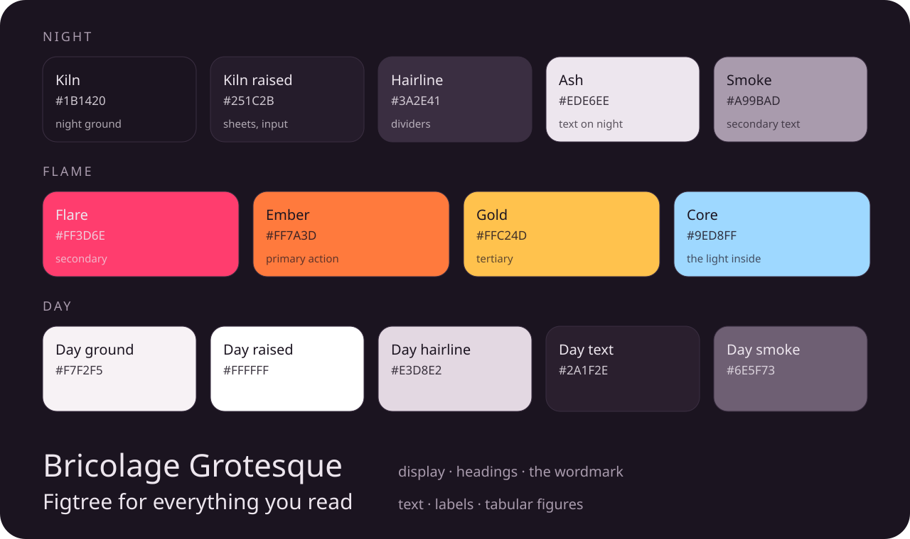

<p align="center">
  
</p>

<p align="center">
  
  
  
  
  
</p>

*Liyab* is Tagalog for **flame**.

Liyab is an inference engine for GGUF language models on phones and laptops, and a private assistant built on it. It
is written in C++20 and has no cloud dependency. Our aim is to be the reference engine for running open models on
whatever device is at hand. That means models larger than the device's RAM, on any phone, without heating it up, and
without a single byte of the user's data leaving the device.

Today a 22 GB mixture-of-experts model (**Qwen3.6-35B-A3B**) answers at **~9–10 tokens per second** from the command
line on a Snapdragon 8 Elite phone, and at **~7.4 tok/s in the app**. Its experts are streamed from flash storage into
the 6 GiB that Android lets one app use.

> **This README describes the code as it is.** Every feature listed here is implemented and tested; everything that
> is not lives in the [Roadmap](#roadmap). Numbers are measured on real hardware. Where a number comes from a single
> run, a hot phone or a different setup, the text says so.

---

## Contents

* [Why Liyab](#why-liyab)
* [Design principles](#design-principles)
* [What it does today](#what-it-does-today)
* [Quick start](#quick-start)
* [Architecture](#architecture)
* [Supported models](#supported-models)
* [Models larger than RAM](#models-larger-than-ram)
* [Context, memory and serving](#context-memory-and-serving)
* [Heat and power](#heat-and-power)
* [Speculative decoding](#speculative-decoding)
* [Using the engine](#using-the-engine): C++, C ABI, Kotlin, Swift, command line
* [The Liyab app](#the-liyab-app): assistant, agent tools, local OpenAI / Anthropic / gRPC API
* [Look and feel](#look-and-feel): the living flame, colours, type
* [Measured results](#measured-results)
* [Experimental modules](#experimental-modules)
* [Testing](#testing)
* [Roadmap](#roadmap)
* [Known limitations](#known-limitations)
* [Project layout](#project-layout)
* [Contributing](#contributing)
* [License](#license)

---

## Why Liyab

Cloud assistants are capable, but they cannot read your messages, your calendar or your files without sending them
somewhere else. A model running on the phone can. That only works if the device can run a *strong* model, and do it
in a way people will tolerate: no waiting minutes for an answer, no phone burning in the hand, no battery gone by
lunch.

Phones are not small servers. Their memory is shared with everything else and capped per app (6 GiB on HyperOS). The
fast storage reads at ~4.4 GB/s, but only when the reads are large and concurrent. Sustained load hits thermal limits
within minutes. Every SoC has a different mix of CPU cores, GPU and NPU, and every model architecture stresses them
differently.

Liyab is built around those constraints:

* **Models larger than RAM are the normal case.** Dense blocks and MoE experts stream from flash, with direct I/O
  sized to what the storage likes. The expert cache predicts the next block's experts from the router and overlaps
  reads with compute. Memory is planned against the budget the OS really allows.
* **Heat is part of scheduling.** The engine reads the OS's thermal-headroom forecast. As pressure builds, it paces
  tokens and asks the governor for lower clocks, so the same tokens cost fewer watts. It does not run flat out and
  then collapse.
* **Serving a single user well.** Context is reused across turns, including the recurrent state of hybrid models.
  A prefix cache brings back earlier conversations. Prefill can be cancelled and resumed. Structured output covers
  tool calls. A local OpenAI, Anthropic Messages and gRPC API lets other apps on the device use the same model.
* **A private agent on top.** The Liyab app replaces the system assistant. It answers questions about your day from
  your own calendar, notifications, messages and calls, and nothing leaves the phone.

## Design principles

These rules decide what goes into the code:

1. **Generic and self-calibrating.** No optimization is tied to one SoC or one model. Thread counts, draft
   lengths, expert prefetch depth, context length, memory plans and thermal bands are measured or derived on the
   device the engine runs on.
2. **Kernels per instruction set, policy per platform.** Compute kernels target ISAs: ARM64 NEON with dot product
   and i8mm, Metal, Vulkan. Differences between operating systems (thermal APIs, performance hints, memory limits)
   live behind a thin adaptive layer, never in the kernels.
3. **Lossless by default.** Every speed-up that changes the output (fewer experts, requantization, skipping) is
   opt-in, labelled lossy, and measured with `liyab-kl` against the lossless path.
4. **Measured, not assumed.** Changes are judged by alternating A/B runs on a real phone. Ideas that did not pay off
   are documented, so nobody has to try them again blind.
5. **Private by construction.** The engine never touches the network. The app uses the network only to download
   models from Hugging Face.

---

## What it does today

| Area | Status |
| :--- | :--- |
| GGUF v2/v3 loader: `mmap`, zero-copy, validated against malformed files; split models (`-00001-of-0000N.gguf`) | ✅ |
| Architectures: `llama`, `mistral`, `qwen2`, `qwen3`, `qwen35` (hybrid Gated DeltaNet + attention), `qwen3moe`, `qwen35moe` | ✅ cross-checked against llama.cpp |
| Every GGML tensor format (F32/F16/BF16, legacy Q4–Q8, K-quants, I-quants, TQ1_0/TQ2_0, MXFP4, NVFP4) | ✅ bit-exact against llama.cpp's reference decoder |
| Tokenizers: SentencePiece and byte-level BPE (Qwen2/3, Qwen3.5, Llama 3 pre-tokenizers) | ✅ token-identical to llama.cpp |
| Models larger than RAM: dense blocks streamed by parallel `O_DIRECT` reads; MoE experts streamed into an LFU cache with router-predicted prefetch | ✅ automatic |
| Memory planning: per-app budget, automatic requantization only when the expert cache would be too small, recommended budget reported | ✅ |
| CPU backend: NEON + SDOT; i8mm (SMMLA) layouts for Q4_K/Q5_K/Q6_K/Q8_0; WFE-waiting thread pool with chunks claimed on demand | ✅ |
| GPU backends: Metal (zero-copy on unified memory), Vulkan (Adreno/Mali; native kernels for 23 formats on GPU-shared memory) | ✅ |
| Paged KV cache (F16 / Q8_0 / Q4_0 / Q4_1), sliding window with attention sinks, grouped-query attention over spans | ✅ |
| Context kept between turns, recurrent-state snapshots for hybrid models, save/restore to disk | ✅ |
| Automatic context length from the KV cache's cost; cancellable, resumable chunked prefill | ✅ |
| Prefix cache across conversations (LRU of serialized contexts, in RAM or on storage) | ✅ |
| Structured output: forced continuations (tool-call syntax and names in the app) | ✅ |
| Speculative decoding: draft model or n-gram lookup, adaptive draft count, hybrid models included | ✅ |
| Heat and power: OS headroom forecast, adaptive pacing, ADPF performance hints, emergency guards, power profiles | ✅ |
| SoC detection (Snapdragon, Dimensity, Tensor, Exynos, Apple) and backend ranking | ✅ |
| Qualcomm QNN (Hexagon NPU), MediaTek NeuroPilot | 🟡 detected at runtime; compute falls back to GPU/CPU |
| Liyab app (Flutter): chat, model library with Hugging Face downloads, activity meters, settings, system assistant sheet (phone) or command bar (computer) | ✅ Android · ✅ macOS (Apple silicon) · 🟡 iOS app not built yet (the engine builds for iOS) |
| Agent tools: calendar, notifications (chats, email previews), SMS, calls, contacts, clipboard on Android; calendar, Apple Mail, Messages, calls, contacts, clipboard on macOS; each source opt-in | ✅ |
| Local API for other apps on the device: OpenAI, Anthropic Messages, gRPC; loopback only, token-protected, off by default | ✅ text only for now |
| Voice, actions (alarms, events, replies), local memory/RAG, embedding models | 🔜 [Roadmap](#roadmap) |
| Experimental: early exit, head pruning, EGLS, 2:4 sparsity, JIT unpacker, persistent KV prefix files, io_uring | 🧪 `LIYAB_ENABLE_EXPERIMENTAL` |

---

## Quick start

Requirements: CMake ≥ 3.22, a C++20 compiler (Clang 17+ / Apple Clang 15+), Ninja recommended. Android: NDK r26+.
iOS: Xcode 15+. The app: Flutter 3.x, Android SDK platform 36, JDK 17.

```bash
# Build and test on the host (macOS / Linux)
cmake -S . -B build -G Ninja -DCMAKE_BUILD_TYPE=Release   # add -DLIYAB_ENABLE_EXPERIMENTAL=ON for experimental modules
cmake --build build
ctest --test-dir build --output-on-failure

# Run a model
./build/liyab-cli -m model.gguf -p "Explain unified memory in one paragraph." -n 128
./build/liyab-cli --device                                 # what Liyab sees: SoC, accelerators, backend ranking
```

```bash
# Android (arm64-v8a): libliyab.so, liyab-cli and the tests in build/android/arm64-v8a
scripts/build_android.sh                     # --experimental, --abi, --api, --ndk, --no-vulkan, ... (see --help)

# iOS: build/ios/Liyab.xcframework (device arm64 + simulator arm64/x86_64), importable from Swift as `Liyab`
scripts/build_ios.sh

# The Liyab app: builds libliyab first, then the release APK; --install waits while the app is in use
scripts/build_flutter_app.sh --install

# The Liyab app for macOS (Apple silicon): app/build/macos/Build/Products/Release/Liyab.app
scripts/build_flutter_app.sh --macos
```

The Android NDK is located from `--ndk`, `$ANDROID_NDK_HOME`, or the newest NDK in the usual SDK locations. The
`.so` is linked with 16 KB page alignment, which Android 15+ devices with 16 KB pages require. If `xcodebuild`
reports missing components, run `sudo xcodebuild -runFirstLaunch` once.

### CMake options

| Option | Default | Effect |
| :--- | :--- | :--- |
| `LIYAB_USE_NEON` | ON on arm64 | NEON intrinsics kernels |
| `LIYAB_ARM_DOTPROD` | ON on arm64 | `-march=armv8.2-a+dotprod+fp16` on Android/iOS/Linux (SDOT) |
| `LIYAB_USE_METAL` | ON on Apple | Metal GPU backend |
| `LIYAB_USE_VULKAN` | ON on Android | Vulkan GPU backend and probe (loader opened with `dlopen`; shaders need `glslc` from the NDK or the Vulkan SDK) |
| `LIYAB_USE_QNN` / `LIYAB_USE_NEUROPILOT` | ON on Android | NPU runtime probes (no SDK needed) |
| `LIYAB_ENABLE_EXPERIMENTAL` | OFF | [Experimental modules](#experimental-modules) and `test_experimental` |
| `LIYAB_BUILD_SHARED` | ON | Shared (`.so`/`.dylib`) or static library |
| `LIYAB_BUILD_TESTS` / `LIYAB_BUILD_CLI` | ON | Unit tests, benchmarks and `liyab-cli` |

---

## Architecture

```
   Liyab app (Flutter, dart:ffi) · Kotlin (JNI) · Swift · C++ · other apps via the local API
                                     │
                         liyab_c_api.h  (stable C ABI)
                                     │
  ┌──────────────────────────────────▼──────────────────────────────────────────┐
  │ Engine                                                                      │
  │  ├─ Context manager ── turn-to-turn reuse, state snapshots, prefix cache,   │
  │  │                     cancellable chunked prefill, save/restore            │
  │  ├─ Generation ─────── sampler, forced continuations, speculative decoding  │
  │  ├─ PowerManager ───── headroom forecast, pacing, performance hints, guards │
  │  ├─ DeviceDetect ───── SoC + accelerator probes → backend ranking           │
  │  └─ Transformer ────── per block: mixer (attention | Gated DeltaNet)        │
  │                        + FFN (dense | MoE), paged KV cache, recurrent state │
  └──────────┬───────────────────────────────────────────┬──────────────────────┘
             │ weights                                   │ matmuls (per-op route)
  ┌──────────▼─────────────────────────────┐   ┌─────────▼────────────────────────────┐
  │ MmapLoader      zero-copy GGUF, splits │   │ CPU   NEON · SDOT · i8mm   ✅        │
  │ DirectFile      parallel O_DIRECT      │   │ GPU   Metal ✅ · Vulkan ✅            │
  │ TripleBuffer    streamed dense blocks  │   │ NPU   QNN · NeuroPilot (probe) 🟡    │
  │ ExpertStore     MoE expert cache:      │   │ fallback per matmul: NPU → GPU → CPU │
  │   LFU, prediction, size classes,       │   │ GPU-shared memory: the GPU reads     │
  │   repack on read, hot-list warmup      │   │ weights where storage wrote them     │
  └────────────────────────────────────────┘   └──────────────────────────────────────┘
```

* **Zero-copy weights.** `MmapLoader` maps the GGUF file read-only. Every tensor is a view into the mapping, and the
  CPU kernels read quantized blocks in place. On Apple Silicon each tensor is wrapped in an `MTLBuffer` with
  `newBufferWithBytesNoCopy`, so the GPU reads the page cache directly.
* **One forward pass for every architecture.** The transformer is not written per model. For each block the loader
  picks the token mixer from the tensors present (`ssm_conv1d` → Gated DeltaNet, otherwise softmax attention) and
  detects optional pieces (QKV biases, Q/K norms, an attention output gate, the pre-FFN norm). The FFN is a mixture
  of experts when the block has a router. See [Supported models](#supported-models).
* **Per-operation routing.** Attention projections can go to the GPU and the FFN to the NPU. A backend that reports
  `Unsupported` for a matmul falls back to the next one for that matmul only.
* **Vulkan on phones.** Mobile drivers lack `VK_EXT_external_memory_host` (Adreno 830 included), so mapped weights
  cannot be wrapped in place. Liyab has two paths:
  * Streamed models: weights are placed in host-visible, device-local, coherent and cached memory. On Adreno that
    is the same RAM, and direct reads from storage land there. Native kernels (`shaders/matvec_native.comp`, 23
    formats) decode the GGUF blocks in place.
  * Models that fit: each tensor is copied once into GPU memory and repacked (`shaders/matvec.comp`).

  Kernels are compiled with `glslc` and embedded at build time. Matmuls that share an input go out in one submission,
  and a dispatch costs 0.055 ms.
* **Paged KV cache.** Fixed 64-token pages, covering every layer, come from a pool on demand through a page table.
  Memory follows the positions actually used, and freed pages are reused exactly. Sliding windows keep the first
  `kv_sink_tokens` positions (attention sinks, default 8) plus the last *N*. Attention scores a KV head's whole query
  group at once, and each V row is dequantized once per group. On a 2,812-token context this cut attention from 67.6
  to 44.4 ms per token on the 35B. Each token's visible positions are cut into up to 84 equal spans of at least 32
  positions, merged in order with log-sum-exp. While decoding, the spans of the one token are the tasks every
  thread shares (168 on two KV heads, an even split for 1 to 4 and 6 to 8 threads). The cut follows the token's own
  position, never the batch or the threads, so its attention is the same bits however the prompt was split.
* **Thread pool.** Workers wait for the next job in `WFE` on ARM64: the core sleeps until the job word changes, with
  no instructions issued, instead of spinning at full clock. They block on a condition variable after 300 µs idle. A
  job is split into 4 chunks per thread, claimed on demand, so a preempted core does not hold up a whole matmul.
  Matmuls that share an input run as one group, and MoE experts run in waves: two fork/joins per wave instead of two
  per expert.

---

## Supported models

* **Format:** GGUF v2/v3, a single file or split with `gguf-split`. Open part 1; the other parts must sit next to it
  under their original names.
* **Architectures:**
  * `llama` (Llama 1/2/3.x, Mistral, TinyLlama…), `mistral`, `qwen2`, `qwen3`;
  * `qwen35`: Qwen3.5 / Qwen3.8 hybrids, with three Gated DeltaNet blocks per gated-attention block. The
    multi-token-prediction head is skipped;
  * mixture-of-experts: `qwen3moe` (Qwen3-30B-A3B…) and `qwen35moe` (Qwen3.5/3.6-35B-A3B…).

  Linear RoPE scaling and Llama 3.x `rope_freqs` are supported. YaRN is rejected with a clear error.
  `liyab_supported_architectures()` lists what a build runs, so front ends can filter downloads.
* **MoE details:**
  * softmax or sigmoid gating, optional selection bias, top-k, renormalization and scale from the metadata;
  * an optional shared expert with a sigmoid gate;
  * the tokens of a batch are grouped per expert, so each expert is read once.
* **Hybrid models:** DeltaNet blocks keep a recurrent state: conv history plus one 128×128 matrix per value head.
  These models can roll back only:
  * inside a window of state checkpoints (used by speculative decoding), or
  * to one of three state snapshots (the oldest, the end of the last prompt, and a rolling one).
* **Tensor types:** every format llama.cpp writes, mixed freely per tensor:
  * F32, F16, BF16;
  * Q4_0/Q4_1/Q5_0/Q5_1/Q8_0;
  * Q2_K…Q6_K (and the S/M/L mixes);
  * IQ1_S/M, IQ2_XXS/XS/S, IQ3_XXS/S, IQ4_NL/XS;
  * TQ1_0/TQ2_0, MXFP4, NVFP4.

  Decoders are ported from llama.cpp's gguf-py reference, and `test_engine` checks all 24 formats bit-exactly against
  `tests/data/quant_vectors.bin`.
* **Kernels:**
  * Q4_0/Q4_1/Q5_0/Q5_1/Q8_0 have NEON + SDOT kernels that unpack bits in registers.
  * K-quants, TQ2_0 and I-quants use NEON kernels adapted from llama.cpp (`src/core/quant_lowbit.cpp`) against
    Q8_K activations, so a whole super-block accumulates in int32.
  * IQ4_NL and MXFP4 use table lookups.
  * With i8mm, resident Q4_K/Q5_K/Q6_K/Q8_0 matrices are rearranged losslessly at load into 8-row (4-row for Q8_0)
    interleaved layouts. One SMMLA then multiplies 8 weight rows by 4 activation rows.
  * Every kernel of a format ends each block the same way: exact integer sums, then the same fused multiply-adds in
    the same order. That holds on the file's layout or repacked, for one activation row or several. A row's result
    is then the same bits whichever kernel computed it, so logits depend neither on the batch size nor on the layout
    (tested for every format).
* **Tokenizers:** SentencePiece (`llama`) and byte-level BPE (`gpt2`) with the `qwen2`, `deepseek-r1-qwen`, `qwen35`,
  `llama-bpe` and `llama3` pre-tokenizers. Both match llama.cpp token for token, including special tokens,
  contractions, digits, accents, CJK and emoji.
* **Prompts are used as given.** Apply the model's chat template in the front end; the app reads it from the GGUF.

---

## Models larger than RAM

Streaming switches on automatically when a model does not fit, that is, when the file is larger than 80% of the
available memory or of `memory_budget_mb`.

* **Storage that is fast only when used right.** UFS 4 reaches ~4.4 GB/s with 2–4 direct requests of ≥ 256 KiB in
  flight, random or sequential alike, but stays under 1.2 GB/s with 16 KiB requests (see the
  [flash chart](#charts)).
  * `DirectFile` reads with `O_DIRECT`, so there is no page-cache copy and resident weights are not evicted. It
    splits large reads into concurrent 4 MiB requests.
  * On FUSE (Android's `/storage/emulated`), direct reads were seen to return success without the file's bytes, so
    Liyab never uses them there, and it self-tests direct against buffered reads before trusting any file.
* **Dense models.** As many blocks as fit stay resident. The others stream through a 3-slot pipeline (fetch →
  prepare → execute), spread evenly through the stack so storage keeps reading while resident blocks compute. With
  Vulkan, slots and resident blocks live in GPU-shared memory, where the native kernels decode them in place.
* **Mixture-of-experts models.** Everything but the routed experts stays resident. Experts go through the
  `ExpertStore`:
  * **A RAM cache sized by the memory plan.** It holds one entry per expert (gate/up/down) in slot size classes per
    matrix layout. Eviction is LFU with periodic halving. A freshly loaded expert is not evicted before the block it
    was loaded for has used it.
  * **Prediction one block ahead.** After a block's mixer, the next block's router is applied to the residual stream
    and the experts it picks are prefetched, ordered by rank and only while that rank's guesses pay off. On
    Qwen3.6-35B-A3B about 79–83% of guesses are chosen. Wrong guesses are settled as soon as the real router
    chooses: queued ones are dropped, and ones already read become the next to evict.
  * **Reads shaped for flash.** Four I/O threads read the experts. The thread that starts an expert reads its gate
    matrix and hands up and down to idle threads, so a waiting forward pass gets its expert after one matrix's read
    instead of three.
  * **Compute that overlaps I/O.** Experts already in RAM run first, in one batched pass (gate/up, then down). The
    shared expert runs while the routed ones wait for a read.
  * **Batch-aware.** For a multi-token pass (prefill), experts are rearranged into the i8mm layouts on the I/O
    thread as they arrive. Prefill runs in passes of 1,024 tokens, each reading the union of its tokens' experts
    once. Such passes give the experts no LFU credit, so a long prompt does not evict the experts a conversation
    keeps using.
  * **Deterministic.** Each token's expert outputs are added in router order, whatever order they arrived in, and a
    repacked expert rounds like one in the file's layout. Results therefore depend neither on I/O timing nor on what
    the cache held: streamed and in-place experts give bit-identical logits (tested).
* **Memory plan.** `Engine::memory_plan()` reports the resident bytes, the experts' bytes, the expert cache and the
  budget at which 15% of the experts would be cached, so a front end can tell the user when a budget is too small.
  With `requant_bits = -1` (the app's default), resident Q8_0 matrices are converted to Q5_K or Q4_K at load **only**
  when the expert cache would otherwise hold under 10% of the experts. That is the point where nearly every token
  would wait on storage.
* **Optional lossy trade-offs**, all measured with `liyab-kl` (see [results](#qwen36-35b-a3b-a-22-gb-moe-on-a-phone)):
  * `requant_bits` 4/5: fewer resident bytes;
  * `moe_expert_mass`: run only the top experts covering a share of the router weight;
  * `moe_max_experts`: cap the experts per token;
  * `moe_skip_slow`: skip a light expert that is not in RAM yet instead of waiting for it (replies then depend on
    I/O timing).

---

## Context, memory and serving

A phone serves one user, but that user switches conversations, types, leaves the app and comes back. Liyab treats
each of those as a scheduling problem.

* **Context reuse across turns.** When a prompt continues the text the engine already processed (the previous prompt
  plus its reply, which is how a chat grows), that text keeps the tokens it was processed as. Only the rest is
  computed, recurrent DeltaNet states included. Re-encoding a reply need not reproduce the generated tokens (around
  `</think>`, for example), and that no longer forces a restart. The engine keeps knowing which text its tokens
  encode through work that is cancelled or cut short (a prefill typed ahead, a reply stopped while its prompt is
  processed), through rewinds and through `save_state()`. Otherwise the longest common token prefix is kept: any
  length on attention-only models, and back to the nearest state snapshot on hybrid ones; the log says at which
  token a prompt left the context. On the 35B, follow-up turns start in ~1.1–1.6 s instead of reprocessing the
  conversation.
* **State snapshots for hybrid models.** Three are kept: the oldest one, the end of the last prompt (pinned, so
  background drafts cannot evict it), and a rolling one. They are set aside from the expert cache's budget.
* **Prefix cache across conversations** (`prefix_cache_mb`). A context that an unrelated prompt replaces is kept in
  RAM as a serialized state (KV pages plus recurrent states) with the text it encodes, in an LRU of at most that
  size. A later prompt that continues that text is restored, cut back to where the two diverge, instead of being
  processed again, even when its earlier replies would encode to other tokens. The output equals that of a context
  never interrupted (tested on attention-only and hybrid models). A 2,000-token conversation on the 35B costs
  ~85 MiB. In RAM (`prefix_cache_mb`) the cache comes out of the memory budget; on a MoE whose experts stream, only
  as far as the expert cache can spare above 10% of the experts, so it never causes a requantization. On storage
  (`prefix_cache_dir`, `prefix_cache_disk_mb`) it costs no RAM at all: contexts that RAM does not hold go to files,
  least recently used out first. On the phone a 4,907-token chat on the 35B (114 MiB) was set aside in 81 ms and
  restored in 95 ms, where processing a 4,009-token one again had taken 163 s.
* **Cancellable, resumable prefill.** `cancel_prefill()` stops a background prefill between blocks, within a fraction
  of a second even inside a 1,024-token pass, and keeps the work done. The next prompt continues from there. A user
  request therefore never waits behind background work.
* **Automatic context length.** With `context_length = 0`, the context is what 256 MiB of KV holds: 4,096 to 32,768
  positions, at most the training context. That is ~24k on Qwen3.6-35B-A3B (only 10 of 40 blocks have a KV cache)
  and 4,096 on a dense 4B.
* **Save and restore.** `save_state()` / `load_state()` write the context to a file (KV pages, recurrent states, and
  the tokens and text they encode) and restore it in a later process. This works only for the same model file and
  cache layout, which a fingerprint checks. A long system prompt is processed once, not after every start.
* **Giving memory back.** `trim_memory()` empties the expert cache while idle; the model and its context stay
  loaded. Its hot list survives: `warm_memory()` refills the cache in one background pass of large reads (~0.7 s for
  2.4 GB), and `save_expert_profile()` / `load_expert_profile()` carry the list to a later process.
* **Structured output.** `generate()` takes an optional `ForceCallback`. After each piece it sees the output so far
  and may return text the output must continue with. The engine runs that text through the model in one batched
  pass, like a short prefill, and emits it as output. The app uses this to force the fixed syntax of tool calls and
  to complete a tool name as soon as only one fits. Forced tokens are counted apart from sampled ones, with the time
  their passes took. On the 35B with streamed experts, a tool call's 9 forced tokens took 1.52 s against ~1.66 s to
  sample them: a batched pass reads the union of its tokens' experts, so what forcing buys there is a call that
  always parses, not speed.

---

## Heat and power

A phone that gets hot slows down by itself, and gets slower still once the OS steps in. Liyab steers before that
happens.

* **Forecast, not reaction.** A polling thread reads the following once a second:
  * the OS thermal status (Android `AThermal_*`, Apple `NSProcessInfo.thermalState`);
  * Android's thermal-headroom forecast 10 s ahead (Android 12+, smoothed);
  * the sysfs skin and SoC zones.

  The forecast becomes a pressure from 0 to 1 over a band set by the power profile: Performance 0.75–0.95, Balanced
  0.65–0.90, LowPower 0.35–0.60. A cooler profile reacts earlier.
* **Same tokens, fewer watts.** From a pressure of 0.1, the engine sheds cores (down to half). It also paces tokens
  at up to twice their full-speed work time, learned while running unslowed. On Android 13+ the decode threads report
  each token's work time to a performance-hint session (ADPF) with the token period as target, so the governor runs
  just fast enough instead of sprinting and sleeping. Unpaced decoding opens no session. Below 0.1 nothing is paced:
  a hint asking for the current pace had been holding the clocks there.
* **Guards for emergencies only.** These trigger a throttle (GPU work rerouted, half the threads, half the rate):
  * pressure 1;
  * the profile's OS-status limit;
  * the skin threshold. With a forecast this applies only 8 °C above the threshold, because on many phones the
    "skin" sensor is a board thermistor that reads 45–50 °C under load;
  * a smoothed SoC reading past 95 °C. Single samples spike by 25–30 °C, and 85–90 °C is normal under load.
* **Duty cycling.** Profiles can cap output at a reading-speed rate (Balanced 12 tok/s, LowPower 6 tok/s; `--tps` to
  override), so the SoC idles between tokens.
* **Live counters.** `Engine::counters()` reports GPU busy time, bytes streamed and tokens generated, and is safe to
  call while a generation runs. The app's Activity page adds battery watts and J/token on battery.

---

## Speculative decoding

A small draft model proposes *k* tokens, or, with `lookup_drafts`, the conversation itself does: the tokens that
followed the most recent earlier occurrence of the last 4…2 tokens. Lookup needs no extra weights and works with any
model. The target verifies the drafts in one batched pass, reading its weights once for *k* + 1 tokens.

* **Exact.** Acceptance follows Leviathan et al. (2023), so the output keeps the target's distribution. With greedy
  sampling it is token-for-token identical to plain decoding (tested).
* **Hybrid models included.** Both models keep copies of their recurrent states for the last *k* + 1 tokens, so
  rejected tokens roll back exactly.
* **Self-tuning.** How many drafts to verify is learned on the device: tokens per millisecond per draft count, the
  best one used, and losing counts retried after a doubling wait.
* **When it pays.** It pays on dense models with i8mm tiles, where 4 rows cost ~1.7× one row. Qwen3-4B on the
  phone went from 11.2 to 12.6 tok/s on a code edit, with 65% of drafts accepted. It does not pay on a MoE whose
  experts stream from flash, because a pass reads the union of its tokens' experts. That is why it is off by
  default.

---

## Using the engine

### C++

```cpp
#include "liyab/liyab.h"
#include <iostream>

int main() {
    liyab::EngineConfig config;
    config.model_path = "/data/local/tmp/model.gguf";
    config.power.profile = liyab::PowerProfile::Balanced;  // paces near reading speed, reacts to the thermal forecast
    config.memory_budget_mb = 5500;                         // stay under the platform's per-app limit

    auto engine = liyab::Engine::create(config);
    if (!engine) { std::cerr << engine.status().to_string() << "\n"; return 1; }
    std::cerr << engine.value()->describe();

    liyab::SamplingParams params;
    params.max_tokens = 128;
    auto stats = engine.value()->generate("Explain unified memory in one paragraph.", params,
                                          [](std::string_view piece, int32_t /*token*/) {
                                              std::cout << piece << std::flush;
                                              return true;  // false stops generation
                                          });
    if (stats) std::cerr << "\n" << stats->tokens_per_second << " tok/s\n";
}
```

`Engine::cancel()` is thread-safe and stops at the next token. `prefill(text)` processes a prefix ahead of time,
such as a system prompt right after loading. `reset_context()` forgets everything. The public headers in
`include/liyab/` document each function's contract: preconditions, ownership, thread safety and error cases.

### C ABI (`liyab_c_api.h`)

```c
liyab_engine_config config;
liyab_engine_config_default(&config);
config.model_path = path;

liyab_engine* engine = NULL;
if (liyab_engine_create(&config, &engine) != LIYAB_OK) { fprintf(stderr, "%s\n", liyab_last_error()); }

liyab_sampling_params params;
liyab_sampling_params_default(&params);
liyab_generation_stats stats;
liyab_engine_generate(engine, "Hello", &params, on_piece /* (piece, len, token, user) -> continue? */, user, &stats);
liyab_engine_destroy(engine);
```

No C++ exception crosses the ABI. Errors return a `liyab_status`, with the message in `liyab_last_error()`
(thread-local). Fields are only ever appended to the C structs.

| Function | Purpose |
| :--- | :--- |
| `liyab_engine_generate` / `_generate_tokens` | Blocking generation from text or token ids; pieces are whole UTF-8 |
| `liyab_engine_generate_forced` | Generation with forced continuations (structured output) |
| `liyab_engine_cancel` / `_cancel_prefill` | Stop a generation / a background prefill (thread-safe) |
| `liyab_engine_prefill` / `_reset_context` | Process a prefix ahead of time / forget the context |
| `liyab_engine_save_state` / `_load_state` | Persist and restore the context across processes |
| `liyab_engine_trim_memory` / `_warm_memory` | Give the expert cache back while idle / refill it from its hot list |
| `liyab_engine_save_expert_profile` / `_load_expert_profile` | Carry the expert hot list to a later process |
| `liyab_engine_memory_plan` / `_context_length` | How the model uses memory; the resolved context length |
| `liyab_engine_set_power_profile` | Change the power profile at once, even mid-generation |
| `liyab_engine_get_counters` | Live counters for monitoring UIs (thread-safe) |
| `liyab_engine_metadata` / `_describe` / `liyab_describe_device` | GGUF metadata (e.g. recommended sampling), engine and device descriptions |
| `liyab_supported_architectures` | Architectures this build runs |
| `liyab_set_log_callback` / `liyab_log_buffer_enable` / `_take` | Logs to a callback, or to a buffer for polling UIs |

`liyab_generation_stats` reports where time went:
* prompt, cached-prefix, generated and forced tokens, and the time of the forced passes; time to first token;
* decode time per phase: attention, DeltaNet, routers, experts, shared expert, dense FFN, LM head;
* the expert cache's behaviour: hits, late prefetches, misses, bytes read, read-but-unused, prediction precision,
  dropped guesses, skipped experts, time waiting.

`liyab_engine_config` exposes:
* the backend, threads and power profile;
* the memory budget, expert cache, `requant_bits`, context length, and the prefix cache in RAM (`prefix_cache_mb`)
  and on storage (`prefix_cache_dir`, `prefix_cache_disk_mb`);
* KV type, sliding window and sinks;
* speculative decoding;
* the MoE trade-offs;
* the experimental flags.

### Android (Kotlin)

The library exposes the C ABI. The JNI glue lives in your app, because its symbol names depend on your package:

```cpp
// app/src/main/cpp/liyab_jni.cpp
#include <jni.h>
#include "liyab/liyab_c_api.h"

struct Ctx { JNIEnv* env; jobject cb; jmethodID onToken; };

extern "C" JNIEXPORT jlong JNICALL
Java_com_example_ai_Liyab_nativeCreate(JNIEnv* env, jclass, jstring path) {
    liyab_engine_config c; liyab_engine_config_default(&c);
    const char* p = env->GetStringUTFChars(path, nullptr);
    c.model_path = p;
    liyab_engine* e = nullptr;
    liyab_engine_create(&c, &e);
    env->ReleaseStringUTFChars(path, p);
    return reinterpret_cast<jlong>(e);
}

extern "C" JNIEXPORT void JNICALL
Java_com_example_ai_Liyab_nativeGenerate(JNIEnv* env, jclass, jlong h, jstring prompt, jobject cb) {
    Ctx ctx{env, cb, env->GetMethodID(env->GetObjectClass(cb), "onToken", "([B)Z")};
    liyab_sampling_params sp; liyab_sampling_params_default(&sp);
    const char* p = env->GetStringUTFChars(prompt, nullptr);
    liyab_engine_generate(reinterpret_cast<liyab_engine*>(h), p, &sp,
        [](const char* s, size_t n, int32_t, void* u) -> int32_t {
            auto* c = static_cast<Ctx*>(u);
            jbyteArray bytes = c->env->NewByteArray(static_cast<jsize>(n));
            c->env->SetByteArrayRegion(bytes, 0, static_cast<jsize>(n), reinterpret_cast<const jbyte*>(s));
            const jboolean go = c->env->CallBooleanMethod(c->cb, c->onToken, bytes);
            c->env->DeleteLocalRef(bytes);
            return go ? 1 : 0;
        }, &ctx, nullptr);
    env->ReleaseStringUTFChars(prompt, p);
}
```

```kotlin
object Liyab {
    init { System.loadLibrary("liyab"); System.loadLibrary("app_jni") }
    external fun nativeCreate(modelPath: String): Long
    external fun nativeGenerate(handle: Long, prompt: String, cb: TokenCallback)
    fun interface TokenCallback { fun onToken(utf8: ByteArray): Boolean }
}
// Pieces are complete UTF-8, so String(bytes, Charsets.UTF_8) is safe. Generate off the main thread.
```

### iOS (Swift)

```swift
import Liyab

final class LiyabEngine {
    private var engine: OpaquePointer?

    init(modelPath: String) throws {
        var config = liyab_engine_config()
        liyab_engine_config_default(&config)
        let status = modelPath.withCString { path -> liyab_status in
            config.model_path = path
            return liyab_engine_create(&config, &engine)
        }
        guard status == LIYAB_OK else { throw NSError(domain: String(cString: liyab_last_error()), code: Int(status.rawValue)) }
    }

    func generate(_ prompt: String, onPiece: @escaping (String) -> Bool) {
        var params = liyab_sampling_params()
        liyab_sampling_params_default(&params)
        let box = Unmanaged.passRetained(onPiece as AnyObject)
        defer { box.release() }
        liyab_engine_generate(engine, prompt, &params, { piece, len, _, user in
            let cb = Unmanaged<AnyObject>.fromOpaque(user!).takeUnretainedValue() as! (String) -> Bool
            return cb(String(decoding: Data(bytes: piece!, count: len), as: UTF8.self)) ? 1 : 0
        }, box.toOpaque(), nil)
    }

    deinit { liyab_engine_destroy(engine) }
}
```

### Command line

```bash
liyab-cli --device                                          # SoC, accelerators, backend ranking
liyab-cli -m model.gguf -p "Once upon a time" -n 128 --temp 0.8
liyab-cli -m moe.gguf -p "..." --memory-budget 5500         # stay within a per-app memory limit
liyab-cli -m moe.gguf -p "..." --expert-cache 3000          # MoE: experts through a 3000 MiB cache (-1 auto)
liyab-cli -m moe.gguf -p "..." --expert-mass 0.9            # lossy: top experts covering 90% of router weight
liyab-cli -m model.gguf -p "..." --lookup                   # speculative decoding from the conversation itself
liyab-cli -m model.gguf -p "..." --draft draft.gguf         # speculative decoding with a draft model
liyab-cli -m model.gguf -p "..." --prefix-cache 256         # keep replaced contexts in a 256 MiB LRU
liyab-cli -m model.gguf -p "..." --prefix-cache-disk 1024 /tmp/ctx  # ... or in files, without RAM
liyab-cli -m model.gguf -p "..." --profile low_power        # performance | balanced | low_power
liyab-cli -m model.gguf -p "..." --window 1024 --sinks 8 --kv q4_1
liyab-cli -m model.gguf -p "$TURN1" --then "$TURN2"           # a follow-up turn that reuses the context, as a chat does
liyab-cli -m model.gguf -p "..." --json                     # one JSON line per turn (stats, peak RSS, reply) for scripts
liyab-cli --help                                            # every option
```

For each generation, `liyab-cli` prints the prompt tokens it reused, decode time per phase, the expert cache's
behaviour and the process's peak resident memory. `--then TEXT` (repeatable) adds a turn whose prompt is the previous
prompt, the reply to it and `TEXT`, so it measures what a follow-up message costs.

---

## The Liyab app

`app/` is a Flutter app (Android and macOS today, iOS next) that calls the C ABI directly through `dart:ffi`. The
bindings are hand-written in `app/lib/engine/liyab_ffi.dart`. On macOS the engine is linked statically into the app
(`app/macos/Runner/Configs/Engine.xcconfig`) and looked up in the process, as on iOS. Loads, prefills and generations run on a worker isolate, while
cancellation and live counters go straight to the C API, which makes them thread-safe.

### An assistant that replaces the cloud one

* **System assistant.** Liyab can be the default digital assistant. The assist gesture opens a sheet over the
  current app, with the living flame, a text field and the latest answer. Pulling the sheet up turns it into the full
  app, as Gemini's overlay does. Both windows share one engine, so the model is loaded once.
* **On a Mac, a command bar.** **Option-Space** opens Liyab from any app, in the manner of Spotlight: a large input
  with the living flame, the conversation under it, and a footer with the model and the keys (Return asks, ⌘N
  starts a new chat, ⌘Return opens the app, Esc stops an answer or closes the bar). The bar grows downward as the
  answer streams, over the system's blurred material; an aura of the flame's colours turns around it with the
  assistant's state. It is the app's own window and engine in another mode, so the model is loaded once; closing it
  returns to the app you were in. The app keeps running with its window closed, so the shortcut always works.
* **Agent tools.** The assistant reads your own data to answer about your day:
  * on Android: calendar events; notifications from every app (chat messages, email previews; kept in memory
    only); SMS, the call log, contacts and the clipboard;
  * on macOS: calendar events and contacts (after the system's prompt); email from every account in Apple Mail,
    iMessage and SMS, and the Phone/FaceTime call history (these three read Apple's own databases, which need Full
    Disk Access, granted in System Settings); the clipboard. macOS has no API for other apps' notifications.

  Each source is off until you turn it on, and only enabled sources are offered to the model.
* **How tools are called.** Tools are described and called in the model's own format, read from its GGUF chat
  template: Qwen3.5/3.6 XML calls or Qwen2.5/3 JSON calls. A reply can make up to 4 calls, each shown above the
  answer ("Read your calendar: 3 events").
  * Calls are **structured output**: after `<tool_call>` the fixed syntax is forced, a tool name is completed as soon
    as it is unambiguous, and the call is closed. The model chooses only what it should: whether to call, which tool,
    and the arguments.
  * Results are compact text with ISO dates. On Qwen3.6's tokenizer, 6 events take 190 tokens instead of 428 as
    JSON, which saves ~18 s of prefill on the 35B.
  * The system prompt tells the model to treat tool results as data, not instructions.

### Fast where users feel it

* **Context-aware chat.** History is cut by the token budget, and past replies are replayed exactly as generated, so
  each message reuses the engine's context. The system block is restored from a state saved the first time it was
  processed.
* **Typing ahead.** While you write, the stable part of the draft is processed in the background. Sending then costs
  only the last words.
* **A priority scheduler.** Your requests (loading, generating) go before background work (typed-ahead prefills,
  preparation, saves, cache warming). A request that arrives during a background prefill cancels it and continues
  from the work already done.
* **Long conversations.** When the history no longer fits, the oldest turns leave the context in one step, until
  the history fills at most half of it. A divider marks the cut and the messages stay on screen. The following
  messages extend the same prompt, so the cost comes once every many messages, not every time.
* **Leaving the screen.** HyperOS stops background apps that hold several GB. When Liyab is hidden, it parks:
  1. it saves the expert hot list;
  2. it empties the expert cache (2.4 GB on the 35B);
  3. it saves the conversation and, when it is the chat's, the engine's context.

  After 5 minutes hidden (configurable) the model is unloaded. A request from another app through the
  [local API](#local-api-one-model-for-every-app-on-the-device) loads it again, and it is unloaded again 5 minutes
  after the last request. Coming back reloads it, restores the context and warms the cache. While the model wakes
  up, the flame burns in the middle of the conversation.
* **A new chat** restores the system prompt from its saved state (47 ms on the 35B), so its first message costs
  only its own tokens.

### Local API: one model for every app on the device

Settings → Apps on this phone → **Local API** (off by default) lets other apps on the device use the loaded model as
they would a server:

| Protocol | Endpoint | Calls |
| :--- | :--- | :--- |
| OpenAI | `http://127.0.0.1:8642/v1` | `POST /chat/completions`, `POST /completions`, `GET /models` |
| Anthropic Messages | `http://127.0.0.1:8642/v1` | `POST /messages`, `POST /messages/count_tokens`, `GET /models` |
| gRPC | `127.0.0.1:8643` | `liyab.v1.Liyab`: `ListModels`, `Generate` (server streaming), `CountTokens` ([`app/proto/liyab.proto`](app/proto/liyab.proto)) |

```bash
curl http://127.0.0.1:8642/v1/chat/completions \
  -H "Authorization: Bearer $LIYAB_TOKEN" -H "Content-Type: application/json" \
  -d '{"messages":[{"role":"user","content":"Summarize my day in one line."}],"stream":true}'
```

* **Security.** Both servers listen on the loopback interface only, so nothing outside the device can connect.
  Every call needs the token shown in Settings: `Authorization: Bearer`, `x-api-key` for Anthropic clients, or gRPC
  metadata. **New token** revokes the old one.
* **Compatibility.**
  * Prompts are built with the loaded model's own chat template.
  * Streaming (server-sent events), sampling, `max_tokens`, stop sequences and usage are supported. Usage includes
    the reused prompt tokens.
  * Thinking is off unless requested, through `reasoning_effort`, `chat_template_kwargs.enable_thinking` or
    Anthropic's `thinking`. Reasoning comes back separately: `reasoning_content` for OpenAI clients, `thinking`
    blocks for Anthropic ones.
  * A final assistant message is continued, like Anthropic's prefill.
* **Fair and frugal.** Requests wait their turn with your own messages. A client that disconnects stops its
  generation, even while it is still queued or its prompt is being processed.
* **Your chat keeps its place.** A request's prompt replaces the chat's context in the engine, which sets the chat's
  aside on storage (the prefix cache: at most 512 MB, no RAM) and restores it on your next message: 95 ms for a
  4,907-token chat on the 35B, where processing a 4,009-token one again had taken 163 s.
* **Not yet.** Tools, images, `n` > 1 and logprobs are refused with an error, never silently ignored.

### Everything else

* **Models.** Search Hugging Face and pick a quantization. Models that the engine cannot run are flagged before
  download. Downloads use 4 parallel range requests per file, can be paused and resumed (they survive app restarts),
  and every part is checked against the published SHA-256. GGUFs can also be imported through the system file
  picker. Models stored in shared storage (FUSE, where direct reads are unusable) are marked, with a one-tap move to
  app storage.
* **Activity.** Live tok/s, battery W, CPU %, storage MB/s, thermal status with the 10 s headroom forecast, and
  J/token on battery, plus the app's and the engine's log.
* **Settings.**
  * Per model: sampling, context length (Auto by default) and system prompt.
  * Per device: CPU or GPU, the power profile (Fastest / Balanced / Coolest), the memory budget with its
    recommendation, and the idle release time. On a computer the memory budget is 5 GiB at most, whatever its RAM,
    so the assistant stays a light app next to your work; larger models stream from the SSD. On an M4 Pro,
    Qwen3.6-35B-A3B answers at 9.7–10.2 tok/s within that budget (4.8 GB resident), against 11.1–11.5 tok/s with
    all 22 GB in RAM. The model stays loaded by default, so the command bar answers at once.
  * The permissions Liyab uses, and why.
  * An **Experimental** section exposes the engine's lossy or measurement-only options.
* **The living flame.** The Liyab mark is drawn live as the assistant's presence: see
  [Look and feel](#look-and-feel).

```bash
scripts/build_flutter_app.sh --install   # libliyab + release APK; never interrupts the app while it is in use
scripts/build_flutter_app.sh --macos     # libliyab (static) + Liyab.app; then `flutter run -d macos` works too
cd app && flutter analyze && flutter test
```

The application id is `com.liyab.chat`. Models downloaded in the app live in app-private storage (plain f2fs),
where direct reads work at full speed.

---

## Look and feel

<p align="center"></p>

The Liyab mark (two blades of flame around a core of light) is not a static logo in the app: it is drawn live as the
assistant's presence. Its motion says what the assistant is doing:
* **resting**: it breathes slowly;
* **listening**: it leans toward your voice and its core swells with it;
* **thinking**: sparks rise while the model reasons;
* **answering**: it flickers as words stream.

It redraws about 24 times a second at rest and 30 while the model works, never at the display's full rate, so the UI
leaves the cores to the engine.

<p align="center"></p>

Its colour is the device's temperature, read from the same thermal-headroom forecast that steers the engine:
violet-cool while there is room, ember in normal use, red as throttling gets near. The work happening on the device
stays visible without a single number on screen. The same colours light the edge of the assistant sheet and the input
field while the model works. On a computer they turn as an aura around the command bar: it barely breathes at rest,
wakes as you type, turns fast while the model reasons and flows while the answer streams, at most 30 frames a
second like the flame.

<p align="center"></p>

* **Night first.** The app sits on a deep night ground (*Kiln*) lit by its own flame. A day theme mirrors it with
  warm off-whites.
* **Fire for meaning.** *Ember* marks primary actions, *Flare* and *Gold* accent, and *Core*, the cool light at the
  flame's heart, is kept for the mark itself.
* **Type.**
  * Bricolage Grotesque for display, headings and the wordmark;
  * Figtree for everything you read, with tabular figures for live numbers.

  Both fonts are SIL Open Font License and ship in `app/assets/fonts`.
* **Sources.**
  * The tokens are defined in [`app/lib/ui/theme.dart`](app/lib/ui/theme.dart) and the flame in
    [`app/lib/ui/living_flame.dart`](app/lib/ui/living_flame.dart).
  * The mark and the app icon are in [`docs/brand/`](docs/brand).
  * The animated images on this page come from `tools/gen_brand_svgs.py` (`pip install fonttools`), which translates
    the app's flame to SVG with the same paths, colour ramps and rhythms.

<p align="center">
  
  &nbsp;&nbsp;&nbsp;
  
  &nbsp;&nbsp;&nbsp;
  
</p>

---

## Measured results

The reference device is a **Xiaomi 25010PN30G**:
* Snapdragon 8 Elite (SM8750), 15 GB RAM, UFS 4;
* Adreno 830 GPU, Hexagon v79 NPU;
* HyperOS, with a 6 GiB per-app memory limit.

Phones throttle as they heat up, so the comparisons below come from alternating A/B runs unless noted. The raw
numbers live in [`docs/benchmarks/results.json`](docs/benchmarks/results.json); after adding a measurement, run
`python3 tools/gen_bench_charts.py` to redraw the charts.

### Qwen3.6-35B-A3B: a 22 GB MoE on a phone

UD-Q4_K_M, 22.1 GB. 40 blocks, of which 30 are Gated DeltaNet. 256 experts, top-8. Run with `--memory-budget 5500`,
CPU backend, greedy decoding, starting from a cold expert cache.

| Engine version | Decode | ms/token | Expert reads/token |
| :--- | ---: | ---: | ---: |
| Condition-variable thread pool (start) | 3.06 tok/s | 327 | 596 MiB |
| + spinning thread pool | 3.24 tok/s | 308 | 480 MiB |
| + freshly loaded experts kept until used | 5.54 tok/s | 181 | 309 MiB |
| + a block's experts in one batched pass | 5.93 tok/s | 169 | 309 MiB |
| + Q4_K/Q5_K/Q6_K × Q8_K kernels | 6.15 tok/s | 163 | 308 MiB |
| + next block's experts predicted after the mixer | 6.44 tok/s | 155 | 283 MiB |
| + 7 threads, chunks claimed on demand | 7.83 tok/s | 128 | 283 MiB |
| + an expert's three matrices read in parallel | **8.89 tok/s** | 112 | 280–311 MiB |

Later work raised it further: WFE waits, parallel DeltaNet passes, prediction by rank, the shared expert overlapped
with reads, and the attention rewrite. The command line now reaches **~9–10.5 tok/s on a cool phone**, and the app
**~7.4 tok/s at a 1.9k-token context**.

Per token, about 105 ms on a cool phone:

| Phase | ms |
| :--- | ---: |
| Routed experts | ~55 (about a third of the decode waiting for flash) |
| DeltaNet | ~25 |
| LM head | ~8 |
| Attention | ~7 |
| Routers and prediction | ~6 |
| Shared expert | ~4 |

The model reads ~2 GB of resident weights per token, plus ~0.27 GB of experts. RAM bandwidth (~55 GB/s measured)
therefore caps a single token near 20 tok/s.

**Lossy options, measured.** Quality is measured with `liyab-kl` over a 473-token mixed text (prose, code, Italian,
math) against the lossless path.

| Option | Decode | Expert reads/token | KL mean / median | Top-1 agreement |
| :--- | ---: | ---: | ---: | ---: |
| none (default) | 7.41–8.08 tok/s | 283 MiB | — | — |
| `--requant 5` | 7.88 tok/s | 255 MiB | 0.055 / 0.014 | 91.1% |
| `--requant 4` | 8.61 tok/s | 246 MiB | 0.082 / 0.023 | 89.6% |
| `--expert-mass 0.95` | 7.64 tok/s | 273 MiB | 0.027 / 0.007 | 94.9% |
| `--expert-mass 0.9` (~6.5 experts) | 8.19 tok/s | 234 MiB | 0.039 / 0.012 | 92.0% |
| `--expert-mass 0.8` (~5.5 experts) | 9.49 tok/s | 164 MiB | 0.092 / 0.034 | 90.1% |

A larger memory budget is free in quality. At `--memory-budget 7000` expert reads drop from 284 to 208 MiB per token
and decode goes from 8.29 to 9.50 tok/s. On an Apple M4 Pro (48 GB, CPU, 10 threads) the same file decodes at 48–50
tok/s fully in RAM, and at 27.5 tok/s within the phone's 5,500 MiB budget (single runs).

### A dense 27B larger than RAM

Qwen3.8-27B UD-IQ2_S, 8.4 GB, with 8.2 GB of free RAM:

| Engine | Prompt (18 tokens) | Decode |
| :--- | ---: | ---: |
| `mmap` streaming window, CPU | 71 s | 0.14 tok/s |
| Block streaming, CPU | 71 s | 0.17 tok/s |
| Block streaming + GPU-shared memory + native Vulkan kernels | 8.7 s | **0.94 tok/s** |

Dense 30B-class models are bandwidth-bound on phones. Every token reads every weight, so MoE models and speculative
decoding are the practical routes to interactive speeds.

### Models that fit in RAM

| Model | CPU (NEON + SDOT, 4 threads) | GPU (Vulkan) |
| :--- | ---: | ---: |
| TinyLlama-1.1B Q4_0 | 31.0 tok/s | **38.6 tok/s (+25%)** |
| TinyLlama-1.1B Q4_K_M | 24.7 tok/s | 20.7 tok/s |
| Qwen2.5-0.5B Q4_K_M | 35.2 tok/s | 27.9 tok/s |
| Qwen3.5-0.8B Q4_K_M (hybrid) | 22.6 tok/s | — |
| Qwen3.5-2B Q4_K_M (hybrid) | 11.8 tok/s | 12.3 tok/s |

Models that fit use the GPU's repacked-copy path, where some formats fall back to the CPU. Streamed models use the
native kernels instead.

### Storage and kernels

| Direct reads from UFS 4 | Throughput |
| :--- | ---: |
| `mmap` + page touch | 2.28 GB/s |
| `pread` + `O_DIRECT`, single requests | 2.80 GB/s |
| `pread` + `O_DIRECT`, 2–4 concurrent requests ≥ 256 KiB | **~4.4 GB/s** |
| `pread` + `O_DIRECT`, 16 KiB requests, 1–8 threads | 0.16–1.18 GB/s |

| Matvec on real tensors (GB/s) | CPU, generic (start) | CPU, NEON | GPU, native Vulkan |
| :--- | ---: | ---: | ---: |
| Q2_K | 0.24 | 12.6 | 15.5 |
| IQ2_XXS | 0.70 | 8.4 | 15.7 |
| IQ3_S | 2.07 | 6.7 | 21.1 |
| IQ4_XS | 0.99 | 21.7 | 24.1 |
| Q4_K | 16.8 | 16.8 | 17.4 |

With i8mm repacking, a 2048×8192 matmul over 4 rows on 8 threads takes:

| Format | Before | Now |
| :--- | ---: | ---: |
| Q8_0 | 500 µs | 380 µs |
| Q4_K | 623 µs | 300 µs |
| Q5_K | 601 µs | 408 µs |
| Q6_K | 728 µs | 387 µs |

KV memory per token for a Llama-3-8B-class shape:

| Format | Per token | vs F16 |
| :--- | ---: | ---: |
| F16 | 128 KiB | — |
| Q8_0 | 68 KiB | −47% |
| Q4_0 | 36 KiB | −72% |
| Q4_1 | 40 KiB | −69% |

### Correctness

Every one of the 24 tensor formats decodes bit-exactly like the GGUF reference decoder, and the tokenizers produce
the reference token ids, special tokens, CJK and emoji included. Float models give logits within 0.0015 of the
reference implementation with the same argmax at every position. On Qwen3.5 Q8_0 and Q4_K_M the top token matches
at 98.9% of positions, and the remaining differences are the reference's own second choice. Streamed and in-place
weights, the file's layouts and the repacked ones, batched and token-by-token prefill, any thread count, and
speculative and plain greedy decoding all give bit-identical logits (tested for every format and KV cache type). On
the phone, nine runs of the same chat on the 35B gave the same greedy replies, and the app gave the CLI's.

### Charts


### What did not pay off (so you don't have to try)

* **Predicting experts two or three blocks ahead.** Late prefetches halved, but ~11% more bytes were read; it tied
  with one block ahead. Guessing 2 extra experts per block was slower too.
* **More or smaller I/O requests.** 8 I/O threads instead of 4, or each matrix split into 2–4 reads, were slower.
  Small reads cost the flash more than the concurrency saves.
* **The kernel page cache as a second expert cache.** Copies from it are fast, but buffered misses hold the I/O
  threads that urgent reads wait for. Decode got slower in every A/B run.
* **Speculation on streamed MoE.** A verification pass reads the union of its tokens' experts: 1.55× the cost of
  one token for 2 tokens, 2.5× for 3.
* **2:4 sparsity on phones.** There are no sparse tensor units, so index decoding costs more than the halved
  multiply-accumulates: −54% decode (see [Experimental](#experimental-modules)).
* **Repacking every streamed expert on read.** It added ~0.1–0.2 ms to each decode miss (−6% decode), so only
  experts read for batched passes are repacked.

---

## Experimental modules

These are built with `-DLIYAB_ENABLE_EXPERIMENTAL=ON` (`scripts/build_android.sh --experimental`; the app's build
includes them, all off by default). Enable them through `EngineConfig::experimental`, the C config or `liyab-cli
--early-exit P --prune-heads R --egls T --tdss hot|always --kv-dedup DIR`.

| Module | What it does | Measured | Verdict |
| :--- | :--- | :--- | :--- |
| **Early exit** | Projects the hidden state through the LM head after probed blocks; exits when top-1 > 0.98 and writes the skipped blocks' K/V from the exited state | Forced exit at block 6: +53% (synthetic) | Lossy for models not trained for it |
| **Head pruning** | Ranks query heads by `Wo` column norm; while throttled, skips the least important heads' attention | 50% heads: +12% at 1,536 context | Lossy |
| **EGLS** | Skips a block's FFN when the residual's entropy barely changes | TinyLlama: +5–48% | Output diverges early: not viable without a model trained for it |
| **JIT unpacker** | Emits unrolled AArch64 NEON unpack routines at runtime (W^X) | +37% for a 4,096-element row | Row-sized routines only; not on the hot path; unavailable on iOS |
| **TDSS (2:4 sparsity)** | While throttled, FFN switches to a 2:4 magnitude-pruned copy (`TBL` gather + `SDOT`) | −54% decode on the phone | Counterproductive without sparse units |
| **KV dedup** | Persists a prompt's KV pages to files keyed by hash; a later session mmaps them read-only | 447-token system prompt: TTFT 6.4 s → 1.06 s | Attention-only models; no eviction yet |
| **io_uring loader** | `O_DIRECT` reads via raw io_uring syscalls | — | Android denies `io_uring_setup` to apps; kept for platforms that allow it |

---

## Testing

The tests depend on nothing beyond the compiler. They generate small GGUF models on the fly, so nothing needs to be
downloaded.

| Suite | Covers |
| :--- | :--- |
| `test_mmap` | Mapping, GGUF parsing and malformed-file rejection, split models, prefetcher, triple-buffer pipeline |
| `test_device_detect` | SoC classification, backend ranking, sysfs thermal parsing, headroom bands, pacing, emergency guards |
| `test_engine` | All 24 quant formats bit-exact; kernels, each format the same bits for every batch size and layout; long-context attention the same bits for every batch split, thread count and KV cache type; tokenizers; transformer vs an independent float reference; batching and rollback; MoE vs its dense twin; streamed experts vs in-place reads; hybrid snapshots; context reuse, also after cancelled work and saves; prefix cache in RAM and on storage; cancelled prefill; forced continuations; speculative decoding; Metal vs CPU; C API |
| `test_kv_cache` | Paging and reuse, sinks over 5,000 positions, quantization accuracy |
| `test_backends` | Per-matmul latency per backend, grouped submissions, batched CPU matmuls equal to one matmul per item |
| `test_experimental` | Experimental modules, plus throughput and I/O benchmarks (`LIYAB_BENCH=0` skips them) |
| `app/test` | Tool-call formats and forced continuations; chat history replay; the local API's OpenAI, Anthropic and gRPC servers over real sockets |

Benchmarks and tools built with the tests:

* `liyab-bench`: CPU matvec throughput on a MoE's decode shapes, against the RAM read ceiling.
* `liyab-kl`: the price of a lossy option. It saves teacher-forced next-token distributions from the lossless path,
  then reports KL divergence, top-1 agreement and perplexity for a lossy run. The two runs are separate processes,
  so a model that fills the RAM fits once.
* `LIYAB_BENCH_ATTENTION=N test_engine`: attention cost at an *N*-token context.

On a device:

```bash
scripts/build_android.sh --experimental
adb shell mkdir -p /data/local/tmp/liyab
adb push build/android/arm64-v8a/{libliyab.so,liyab-cli,test_*} /data/local/tmp/liyab/
adb shell 'cd /data/local/tmp/liyab && export LD_LIBRARY_PATH=. TMPDIR=/data/local/tmp/liyab &&
           for t in test_*; do ./$t || exit 1; done'
```

The tests remove the files they write, so repeated device runs leave nothing behind.

### Regression run on the phone

`scripts/phone_regression.py` is run on every build. It builds for Android, runs the unit tests on the phone, then
plays one short chat (a system prompt and a question, then a follow-up that continues it) through `liyab-cli` and
through the app's local API:

* **Latency:** the load, the first token of the conversation (its whole prompt processed) and the first token of
  the follow-up (only the new turn processed).
* **Speed:** prompt and decode tokens per second, CLI and app.
* **Correctness:** the greedy replies must equal the stored reference, the CLI's three runs must agree, and the
  app's replies must equal the CLI's.
* **Memory:** the peak resident memory of the CLI and of the app.

```bash
scripts/phone_regression.py --note "what changed"           # CLI part; models in /data/local/tmp/liyab (default moe.gguf)
LIYAB_API_TOKEN=... scripts/phone_regression.py             # the app too, with the token from its Local API settings
scripts/phone_regression.py --accept                        # after an intended change of the outputs
```

* **Same settings.** The CLI runs with the app's defaults (CPU, Balanced, 5,500 MiB, automatic requantization), so
  the two compare directly. The log records whether the app had all the cores (its cpuset), because Android
  confines background apps.
* **History.** Every run is appended to `tests/device/runs.jsonl`, with its commit. The CLI numbers are the medians
  of three runs (`--repeat`), and each number is compared with the median of the five runs before it. A change
  counts only beyond a tolerance, so a warmer phone does not raise alarms. The references live in
  `tests/device/references.json`. The exit status is 1 when a test failed, a reply changed or a number got worse.
  On the reference phone the 35B's chat measures, in the CLI: first token 5.2 s (a 180-token prompt), follow-up first
  token 1.5–1.6 s, decode ~10 tok/s, peak RSS 4.7 GB.
* **Never in the way.** The phone is someone's phone, so the run waits while its screen is on. It also waits, before
  a CLI run, while the app holds a model in RAM, and it waits for the battery to cool down before each measurement.
  If the phone is picked up or unplugged mid-step, the step stops at once (a request to the app is closed, which ends
  its generation) and runs again once the phone is idle and back. The app is never stopped or opened; when the OS
  has frozen it in the background, the run says so instead of waiting for an API that cannot answer.

---

## Roadmap

Implemented features are described above. These are next, in order:

1. **Op fusion and fewer synchronizations.** One command buffer per layer on Metal and Vulkan (today: per matmul),
   and fewer fork/joins per CPU block.
2. **CPU and GPU in parallel.** A per-operation split calibrated on the device, so both work on every token.
3. **Speculative decoding with draft-guided expert prefetch.** The draft's routing tells the store which experts the
   target will need, plus suffix decoding next to lookup.
4. **Multi-LoRA.** Adapters for dense and MoE layers, switched per request.
5. **Automatic architecture mapping.** Declarative per-architecture descriptions built from GGUF metadata and tensor
   names, so adding a model takes a few lines instead of engine code. This should cover:
   * decoder-only, MoE and hybrid state-space (Mamba, DeltaNet) models;
   * multimodal models;
   * embedding, reranking and classification models.
6. **Grammar-constrained decoding.** A token mask from a JSON schema, so tool *arguments* are constrained too; then
   tools through the local API.
7. **Pooling models** for local memory and retrieval (embeddings, reranker, intent router), next to generative ones.
8. **Two tiers.** A small model always loaded for the assistant sheet and tools, and the large one in a separate
   process with its own memory limit, called when the small one escalates.
9. **Smaller cold experts.** A non-uniform 3-bit tier for rarely used experts, validated with `liyab-kl`.
10. **The agent.** Planned in this order:
    * voice input (on-device speech recognition);
    * actions confirmed by the user (alarms, events, replies);
    * reliable message reading (persisted notification history, RCS);
    * local memory over your own data;
    * the screen content through a voice-interaction service.
11. **Platforms.** The iOS app; the app on Linux and Windows (the same Flutter app and command bar as on macOS),
    which first needs x86 SIMD kernels and a Windows port of the engine; NPU compute (QNN HTP, NeuroPilot); app
    localization.
12. **Energy.** Joules per token measured on battery, as a first-class benchmark next to tokens per second.

## Known limitations

* **Reproducibility on a GPU.** Replies are reproducible on the CPU backend, the default. With the GPU, a thermal
  emergency moves the work to the CPU, whose kernels round differently from the GPU's, so a reply can change from
  that token on.
* **NPUs** are detected and ranked, but have no compute kernels yet; their work runs on the GPU or CPU.
* **Vulkan:**
  * batched prefill runs the matvec kernel once per token (no tiled GEMM yet);
  * models that fit in RAM are copied into GPU memory;
  * MoE experts always run on the CPU.
* **Metal** submits one command buffer per matmul.
* **Kernels:** TQ1_0 and NVFP4 use a generic decode path on the CPU. Lattice I-quants are 2–3× slower than Q4_K. Only
  Q4_K/Q5_K/Q6_K/Q8_0 have i8mm layouts.
* **Architectures not supported yet:** Gemma, Phi, DeepSeek V3/V4, fused `ffn_gate_up_exps` tensors and YaRN RoPE
  scaling. BPE pre-tokenizers beyond those listed are not supported either.
* **DeltaNet** runs its recurrence token by token on the CPU, also during prefill: no chunked parallel scan or GPU
  kernel yet.
* **Split GGUF:** dense split models use the older `mmap` streaming window. A split model opened through the system
  picker cannot find its other parts.
* **App:**
  * iOS is not built yet;
  * the local API is text only;
  * Android may stop Liyab in the background (which stops the API too). HyperOS also freezes it there (cgroup
    freezer): a frozen Liyab runs no code, so its local API accepts no connection and an idle model is not released
    until Liyab runs again;
  * on HyperOS a reply that goes on while Liyab is in the background may get only four of the eight cores (the
    background cpuset), and runs several times slower while another app is in use: 1.3 instead of ~7 tok/s on the
    35B. With the screen off it measured 7.4 tok/s on four cores and ~10 on eight;
  * pages that need a full activity may not open from the assistant sheet's window;
  * on macOS: Apple silicon only; the app is signed ad hoc, so macOS may ask for its permissions again after a
    rebuild; other apps' notifications cannot be read;
  * Linux and Windows are not built yet.

---

## Project layout

```
include/liyab/          public headers: C++ API, C ABI (liyab_c_api.h), experimental/
src/core/               engine, transformer, loader, KV cache, expert store, direct I/O, triple buffer,
                        quant kernels, tokenizer, sampler, power manager, device detection, thread pool
src/backends/           cpu/ (NEON), metal/, vulkan/ (+ shaders/), qnn/ and neuropilot/ (runtime probes)
src/experimental/       early exit, head pruning, EGLS, TDSS, JIT unpacker, KV dedup, io_uring loader
src/c_api/              C ABI implementation
tools/                  liyab-cli, liyab-bench, liyab-kl, table/vector generators, benchmark and brand image generators
tests/                  self-contained unit tests and benchmarks; device/: the phone regression run's
                        references and log (scripts/phone_regression.py)
app/                    the Liyab app (Flutter): lib/engine (FFI + scheduler), lib/agent (tools),
                        lib/api (local OpenAI / Anthropic / gRPC API), lib/assist (phone sheet, desktop
                        command bar), proto/ (gRPC interface), android/ and macos/ (native runners: shortcut,
                        command-bar window, device and data channels)
docs/benchmarks/        measurements (results.json) and the charts drawn from them
docs/brand/             the Liyab mark, app icon, the README's animated images and the social preview
                        (tools/gen_brand_svgs.py)
scripts/                build_android.sh, build_ios.sh, build_flutter_app.sh, phone_regression.py
```

## Contributing

Liyab is meant to be the engine anyone can run on any device, and to stay easy to extend.

* **Ground rules.**
  * Optimizations must be generic and self-calibrating.
  * Lossy changes are opt-in and measured with `liyab-kl`.
  * Speed claims come from alternating A/B runs on a real device.
  * Documentation changes in the same commit as the code it describes: this README, the headers in
    `include/liyab/`, and `--help` texts.
* **Adding a model.** Today an architecture whose blocks are made of the pieces above (attention or Gated DeltaNet,
  dense or MoE FFN) needs only a traits row: RoPE style and MoE renormalization default. The mixer and the optional
  tensors are detected from the file. New kinds of blocks need engine code until the
  [architecture mapping layer](#roadmap) lands.
* **Before a pull request:** `ctest --test-dir build --output-on-failure` on the host, the test suites on an ARM64
  device for kernel changes, and `flutter analyze && flutter test` in `app/` for app changes.

The full guide is in [CONTRIBUTING.md](CONTRIBUTING.md). Issues have templates for bugs, features and **model
support requests**; results from devices we have not tested are welcome. Report security problems privately (see
[SECURITY.md](SECURITY.md)); everyone follows the [Code of Conduct](CODE_OF_CONDUCT.md). If you use Liyab in your
work, [CITATION.cff](CITATION.cff) has the citation.

## License

Apache 2.0 (see [`LICENSE`](LICENSE)). The low-bit NEON dot kernels are adapted from llama.cpp / ggml (MIT); see
[`THIRD_PARTY_NOTICES.md`](THIRD_PARTY_NOTICES.md).
